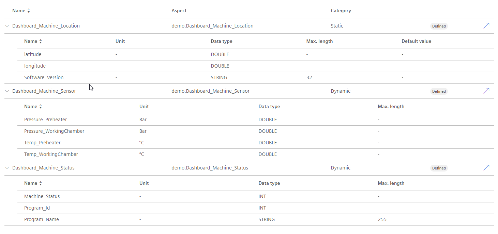

# Setup steps for the getting started VFC Dashboard:
This short tutorial will show you how to set up the simulated assets and the data generator for the VFC dashboard example.

# Asset Setup
We want to create an Asset Type **VFC_Dashboard_Machine** as a **core.basicasset**:

with three Aspects assigned to the Aseet type:
- Dashboard_Machine_Location [Static]
- Dashboard_Machine_Sensor [Dynamic]
- Dashboard_Machine_Status [Dynamic]

To do this, please follow the following steps:
- [x] Setup static Aspect type Dashboard_Machine_Location with three variables:
  - latitude [DOUBLE]
  - longitude [DOUBLE]
  - Software_Version [STRING, 32]
- [x] Setup dynamic Aspect type Dashboard_Machine_Location with four variables:
  - Pressure_Preheater [Bar, DOUBLE]
  - Pressure_WorkingChamber [Bar, DOUBLE]
  - Temp_Preheater [°C, DOUBLE]
  - Temp_WorkingChamber [°C, DOUBLE]
- [x] Setup dynamic Aspect type Dashboard_Machine_Status with three variables:
  - Machine_Status [INT]
  - Program_Id [INT]
  - Program_Name [STRING, 255]
- [x] Create an Asset Type of parent type core.basicasset, name it **VFC_Dashboard_Machine** and add the three created Aspect types under the Aspects dropdown window

Your Asset type should look like this:

