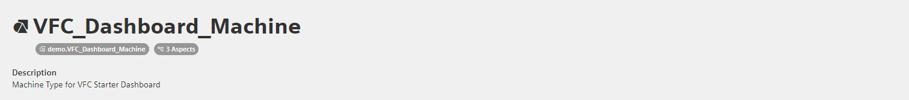
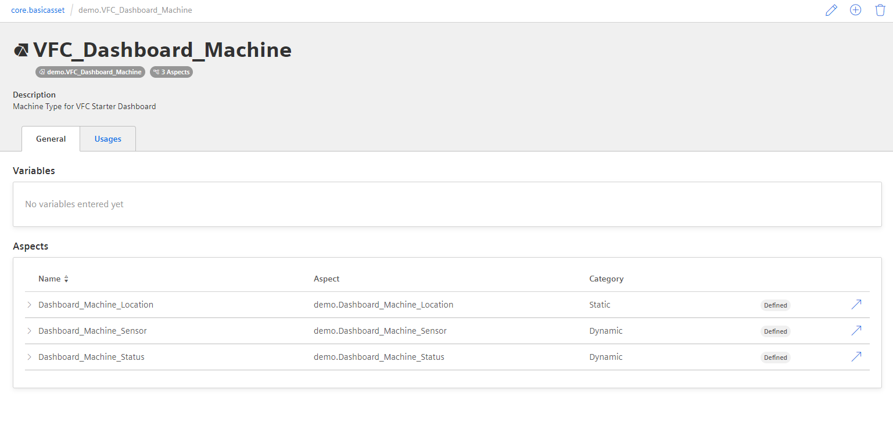
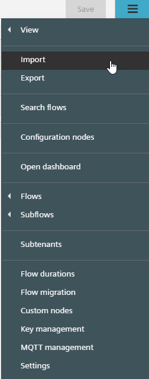
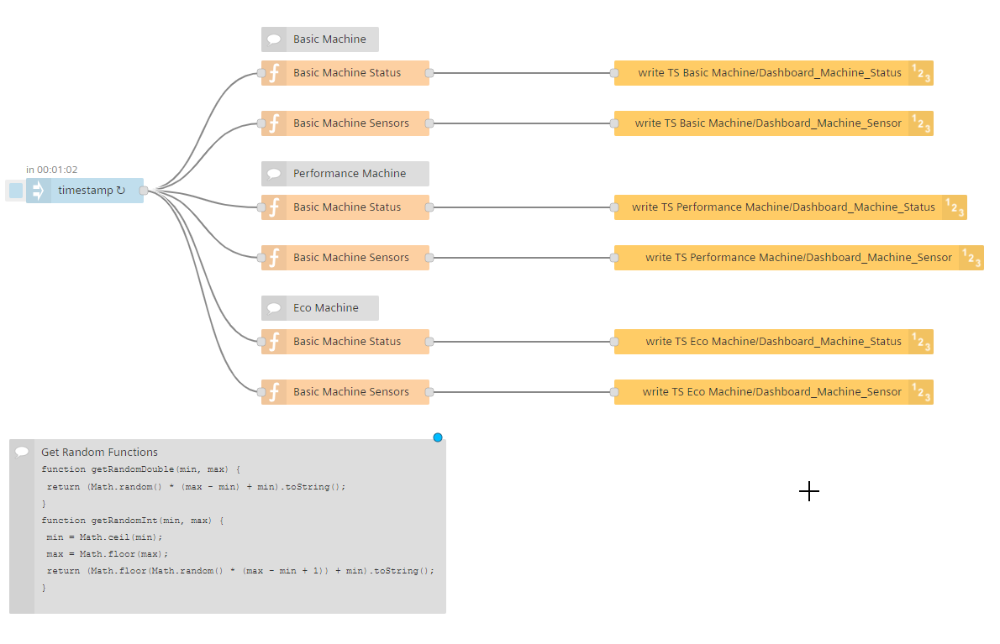
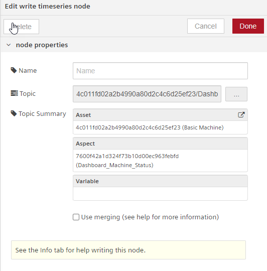
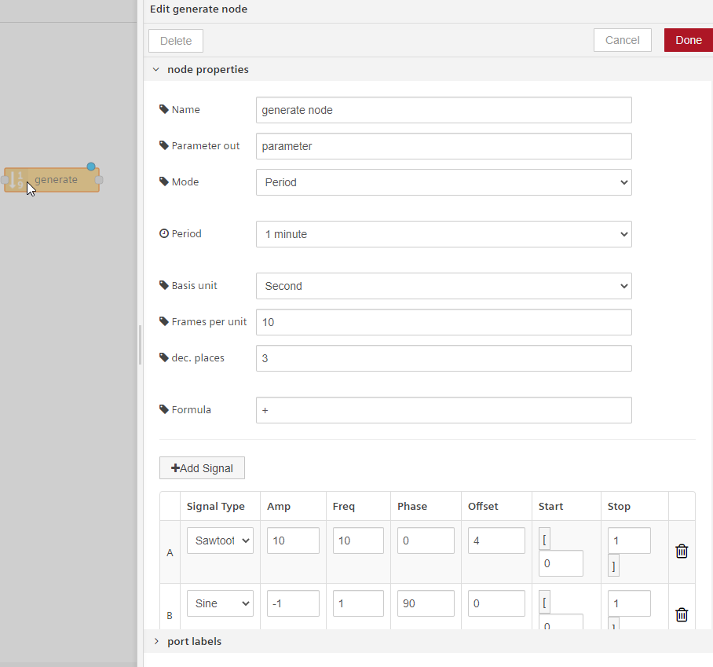

# Setup steps for the getting started VFC Dashboard:
This short tutorial will show you how to set up the simulated assets and the data generator for the VFC dashboard example.

# Asset Setup:
We want to create an Asset Type **VFC_Dashboard_Machine**:



with three Aspects assigned to the Aseet type:
- Dashboard_Machine_Location [Static]
- Dashboard_Machine_Sensor [Dynamic]
- Dashboard_Machine_Status [Dynamic]

To do this, please follow the following steps and note the notation for the variables is [Unit, DATATYPE, Max. lenght]
- [x] Setup static Aspect type Dashboard_Machine_Location with three variables:
  - latitude [-, DOUBLE, -]
  - longitude [-,DOUBLE, -]
  - Software_Version [-, STRING, 32]
 
- [x] Setup dynamic Aspect type Dashboard_Machine_Location with four variables:
  - Pressure_Preheater [Bar, DOUBLE, -]
  - Pressure_WorkingChamber [Bar, DOUBLE, -]
  - Temp_Preheater [°C, DOUBLE, -]
  - Temp_WorkingChamber [°C, DOUBLE, -]

- [x] Setup dynamic Aspect type Dashboard_Machine_Status with three variables:
  - Machine_Status [-, INT, -]
  - Program_Id [-, INT, -]
  - Program_Name [-, STRING, 255]
- [x] Create an Asset Type of parent type core.basicasset, name it **VFC_Dashboard_Machine** and add the three created Aspect types under the Aspects dropdown window

Your Asset type should look like this:



- [x] Now Create 3 Assets of type **VFC_Dashboard_Machine** and name them:
  - Basic
  - Performance
  - Eco

For the purpose of this example, let's assume you are a factory manager that has three different machines (Basic, Performance and Eco), but they all share the same data model. Now you want to monitor them, but to do so, your machines need to send data. Let's generate some data using Mindspheres Visual Flow Creator application.

# VFC Data Generator:
The Visual Flow Creator (VFC) is a [Node-RED](https://nodered.org) based application that can simplify and automate a lot of tasks inside Mindsphere. If you are new to the VFC, please take a few minutes and go through the basics in our [Documentation](https://documentation.mindsphere.io/resources/html/visualflow-creator/en-US/index.html). It will help you understanding the concept of VFC tremendously.

Start by creating a new flow and name it something like *DataGenerator*. Then copy the json data from the [DataGenerator.json](../Resources/DataGenerator.json) file to your clipboard and go back to the VFC.

Under the options tab, click on import:



and paste the json data in the blank field. Click on import and you should have couple of nodes that you can now place in the flow. Then Click Save

Your DataGenerator Flow should now look like this:



> This flow will be triggered by the inject node every 5 minutes. If you want to alter the interval data is written to your machines, feel free to do so.

To finish this flow, you have to map the 6 write timeseries node to your own corresponding machines. Double click on a node and choose your asset & aspect by clicking on the three dots:



> Make sure you are writing to the correct machine and the correct aspect. **Do not write directly to a variable (-> leave the variable field blank)** as we are writing several variables of an Aspect at the same time. You will get an error message if you do so. 

:white_check_mark:  :white_check_mark:  :white_check_mark:  :white_check_mark:  :white_check_mark:  :white_check_mark:

Your Data Generator is ready to go and will run in the background. Now **[Continue Here](../readme.md#overview-dashboard)** and get started building your VFC Dashboard!

:white_check_mark:  :white_check_mark:  :white_check_mark:  :white_check_mark:  :white_check_mark:  :white_check_mark:

### Data Generator best practices:
VFC offers a build in method to simulate/generate data with the *generate node*. You can use it to create powerful data patterns.



However, sometimes the easy way does also the job. Why not simply take a random INT or DOUBLE from a defined interval?
```javascript
function getRandomInt (min, max) {
    min = Math.ceil(min);
    max = Math.floor(max);
    return (Math.floor(Math.random() * (max - min + 1)) + min).toString();
}
```
```javascript
function getRandomDouble (min, max) {
    return (Math.random() * (max - min) + min).toString();
}
```
You can use these javascript code snippets in a *function node*:


generate the necessary data und pass them as *msg.payload* to our *write-timeseries node*.
You can use the same (simple) logic to generate a string by picking a random index of a string array.

```javascript
function getRandomInt(min, max) {
    min = Math.ceil(min);
    max = Math.floor(max);
    return (Math.floor(Math.random() * (max - min + 1)) + min).toString();
}

let StringList = ["String A", "String B", "String C", "String D", "String ...", "String X"];

let progr = StringList[Math.floor(Math.random() * StringList.length)];
var stat = getRandomInt(1,5);
var id = getRandomInt(1000,9999999);

var obj = {};
obj._time = new Date();
obj.Machine_Status = stat;
obj.Program_Id = id;
obj.Program_Name = progr;

msg.payload = obj;
return msg;
```

