# VFC Dashboard - A Getting Started Example:
This example will guide you step by step through the VFC Dahsboard functionalities. You will create a simple but interactive dashboard that shows the status of your three (simulated) machines that you already connected to Insights Hub. You will learn the essential nodes for dashboarding with the VFC and will be able to extend your dashboard according to your own needs. The Dashboard you create will look like this:

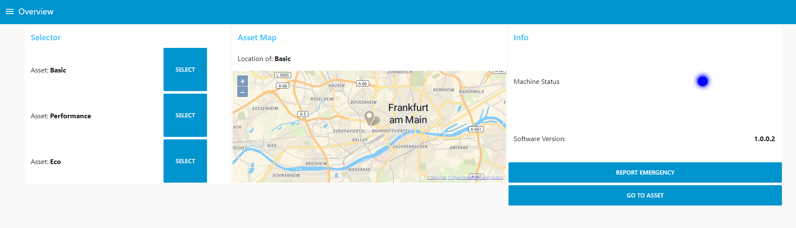

This tutorial is meant to start from scratch. You will set up your Assets, generate data for them and build your dashboard on the basis of this data. If you just want to check out the dashboard, import it [From Here](./Resources/IMPORT_Dashboard.json). Please note, that you have to change major components to fit the dashboard to your own tenant's asset model. 

# Prerequisites:
- around 120 minutes of time
- Visual Flow Creator
- Asset Manager
- basic Javascript knowledge is helpful, but not required
> All required applications and resources are part of a [Start for free](https://siemens.mindsphere.io/en/start) tenant. You can follow this tutorial along regardless of your Insights Hub package.

> This tutorial is designed for beginners. However, some fundamental knowledge about the VFC will make your learning journey more enjoyable. Learn the basics [Here](https://documentation.mindsphere.io/resources/html/visualflow-creator/en-US/index.html).

# Setup:
We will simulate three different versions of an industrial machine:
- Basic
- Performance
- Eco

This step requires you to be familiar with Insights Hub's asset structure and that you can create new aspects, assets and asset types. If this sounds like a big headache to you, please visit the [Asset Manager Tutorial](https://siemens.mindsphere.io/en/docs/tutorials/asset-manager) first.

If not, please follow the [Setup Instructions](./Setup/readme.md) and come back once you completed the process.

# Dashboard Structure:
Start by creating a new flow and name it something like *Dashboard* or *MyFirstDashboard*. Then switch to the dashboard tab under Layout, which will be blank for now.

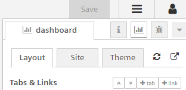

Here you can structure the basic layout of your dashboard using tabs and groups. A tab is the equivalent of a dashboard page. You can assign different content to each tab and it will then only be displayed on that that. Each tab will display your content in groups, which act like columns. For example, a structure that you created under *Tabs & Links* like this:

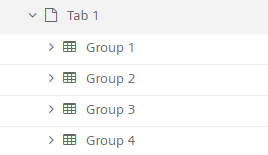

the corresponding dashboard page would be organized as shown below:

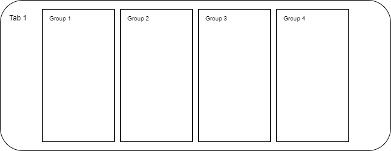

Inside a group (column), the dashboard content is structured vertically, from top to bottom. If you assigned three items to a single group on a single tab like this:

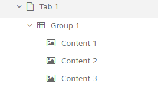

the corresponding dashboard page would be organized as shown below:

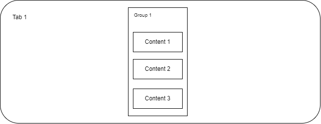

As you can see, *Group 1* is centered automatically on the tab. You don't have to worry about the position of your groups, Mindsphere does that automatically for you. Just remember the following rule of thumb:

> **Tabs** are **individual dashboard pages**. You can only view one tab at once.

> **Groups**, that are structured from **top to bottom**, will be displayed from **left to right** on your dashboard page.

> **Content**, that is structured from **top to bottom**, will be displayed from **top to bottom** inside a group.

Now let's start building the overview dashboard:
- Create a tab and name it *Overview*
- Under *Overview*, create three new groups
- Rename these groups to *Selector*, *Asset Map* and *Info*
- Remember the way the VFC is displaying groups. You want to place the *Selector* group on the left and the *Info* group on the right

You can rename tabs and groups by hovering over them and clicking the *edit* button:

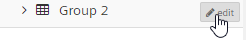

Now create a second tab called *Detail* with only one group named *Events*. We will use the *Detail* tab at the very end of this tutorial, so consider this a little teaser.

# Designing the Dashboard:
In this chapter, we will bring some life and functionality to our Overview dashboard. This tutorial is designed to build all elements from scratch and simultaneously show the logic behind a VFC dashboard. Some steps might be overcomplicated with the purpose of demonstrating several VFC nodes.

> If you just want to check out the final result, you can copy paste the [Json Flow Data From Here](./Resources/IMPORT_Dashboard.json). It will import all elements, including nodes, tabs and groups. Remember to adjust all *read-timeseries* and *write-timeseries* nodes to your own assets.

For the beginning, we will place three *text* nodes and three *button* nodes in the flow. This will be our Asset selector, where each machine has it's own button like below:

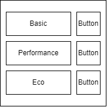

But before styling our nodes, we have to adjust the width of the group. Click *edit* on the *Selector* group and give it a width of 9. Rearrange your nodes in the flow, so that the *text* nodes are alternating with the *button* nodes, starting with the text node. Double click the first *text node* to open it's properties. Here you can assign the node to a group and change it's apperence. We will start with our Basic machine. Copy the following setting:

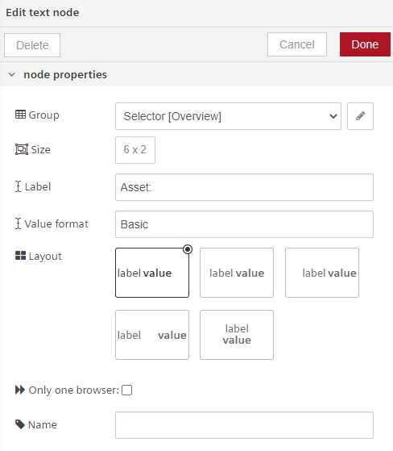

So we assigned the *text* node to our *Selector* group, gave it a form of 6x2 (width x height) and chose the: <br> *label* **value** (left aligned)<br> format, where *label* = Asset: and **value** = Basic. This text is static and will not change depending on the input.<br> Now rinse and repeat for the other two *text* nodes, but remember to change the **value** to Performance and Eco.

Now apply the following settings to the three *button* nodes:

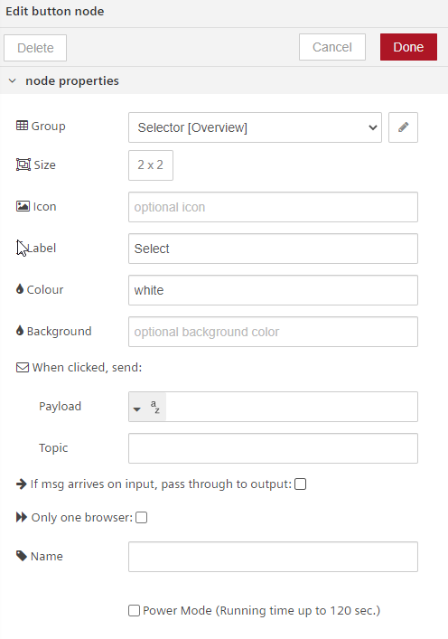

The positioning of nodes in the flow is not relevant for the structure of the dashboard. By organizing your flow, you will have a huge benefit once it get's complicated, but the order of the nodes under the *Selection* group is decisive. The check, which node in the group is the corresponding node in the flow, just hover over it. The node in the flow will be bordered red:

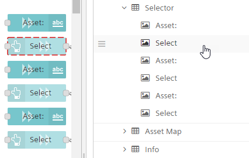

Your flow should look like this:

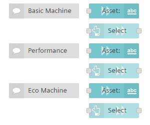

Now you want to switch to your dashboard and view your progress.
>Hint: You can open your dashboard by clicking *Open dashboard in new tab*. Here, you can also reload all dashboards to apply changes made to the flow model.
>
>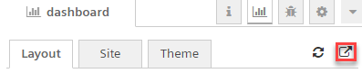

The *Selection* group of the dashboard should look like this:

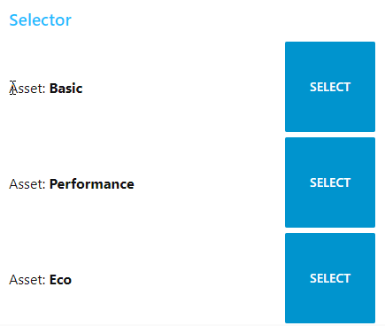

The next step is to implement a map, where you can see the location of the asset you chose in the *Selector* group. Mindsphere offers some pre-build nodes, that reflect the Mindsphere look and feel and can be implemented into your VFC dashboards. You find them in the *MDSP Dashboard* node section. There is a date picker, timeseries chart, asset list, aspect variable selector, event table and the Mindsphere Map. But first, change the *Asset Map* group width to 122. Now drop the *MDSP Map* and another *text* node into your flow, assign them to the *Asset Map* group (the *MDSP Map* node is positioned below the *text* node)  and configure them as follows:

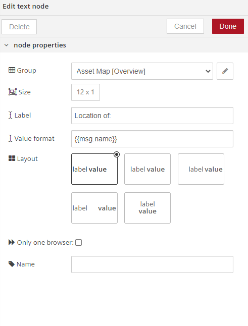

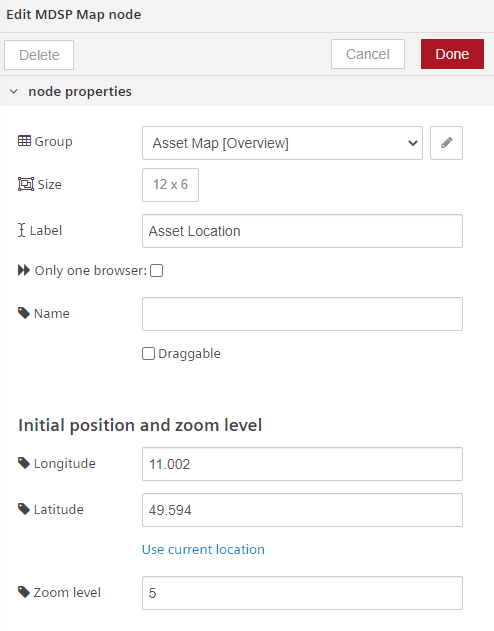

Maybe you have noticed that we already set initial position and zoom level for the *MDSP Map* node. Feel free to alter the position to your company's headquarters and experiment with the zoom level. Furthermore, the **value** of the *text* node is {{msg.name}}. We want to display a dynamic text which changes depending on your selection in the *Selector* group. The text node will check the incoming message to have a msg.name property and will display it`s value. Changing the text according to the selected Asset is great, but we want to display the stored location of this asset in the map too.

> You can change the initial position of the *MDSP Map* by sending a payload with {latitude, longitude, zoomLevel}

Let's assume, our three machines Basic, Performance and Eco are located on three different fairs in Germany as exhibition machines. Basic is located at fair Frankfurt, Performance at fair Munich and Eco at fair Berlin. We have already set the location of the machines in the [Setup](./Setup/readme.md#asset-setup) and want to get these locational informations into our flow. This can be achievend using the *read-aspect-static* node, as we want to read data from the static aspect *Dashboard_Machine_Location*. Configure one *read-aspect-static* node for each machine with the given example:

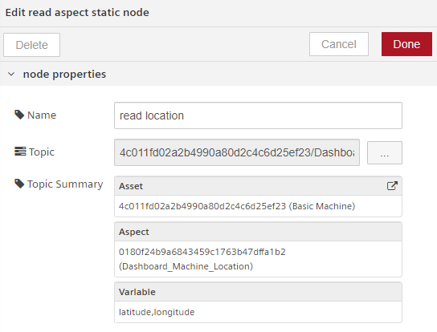

In the next step, we hava to transform the data to the form {latitude, longitude, zoomLevel}, so that the *MDSP Map* can interpret the input. We achieve this using *function* nodes. Create three *function* nodes (again, one for each machine) and use the following code:

```javascript
var long = msg.payload.longitude;
var lat = msg.payload.latitude;

var maploc = {'longitude':long,'latitude': lat,'zoomLevel': 12};
msg.payload = maploc;
msg.name = 'INSERT MACHINE TYPE HERE';
return msg;
```
Obviously, change ***INSERT MACHINE TYPE HERE*** to the corresponding machine type in your function code.

Now it is time to connect the nodes and complete our first dashboard functionality:

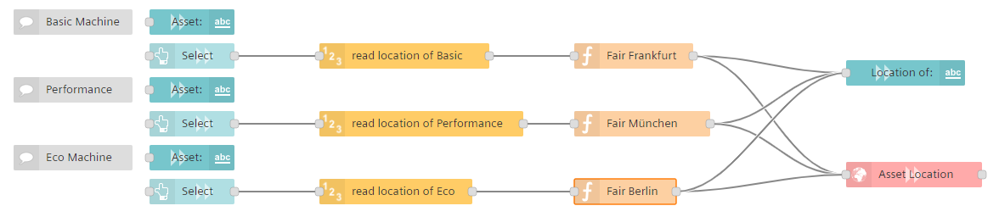

Now try out your dashboard. The *Location of* and Map view should change every time you click an Asset in the *Selector* group:

https://user-images.githubusercontent.com/90254123/164717991-9ee5fa5a-f5b6-4deb-a426-beec63d6571a.mp4

Our next topic will be the third group, the *Info* group. Here we want to display some quick info about the selected machine. In this case:
- A status indicator
- and the software version, the machine is running on

First things first, adjust the width of the *Info* group to 12. Now we are facing a design problem: If we load or reload the dashboard (so no machine is selected), the whole skeleton of the *Info* group would be visible, but empty. So we want to hide the *Info* group by default and only display it if any of the machines is selected. We can use the *ui control* node from the *dashboard* section. The default function iss to change the currently displayed tab by sending the tab name as *msg.payload*, but you can also control the visibility of groups of widgets by sending a payload in the form:
```JSON
{
  "group": {
    "hide": ["tab_name_group_name_with_underscores"], 
    "show": ["reveal_another_group"], 
    "focus": true
  }
}
```
>The "focus" : true is optional.

Another feature of the ui node is that it emit's a msg when a browser client connects or looses connection. Let´s combine these funtionalities to create the following. When the dashboard is loaded, the ui node emit's a message and the *info* group is hidden. On the other hand, when you select one of the machines, the *info* group is displayed again:

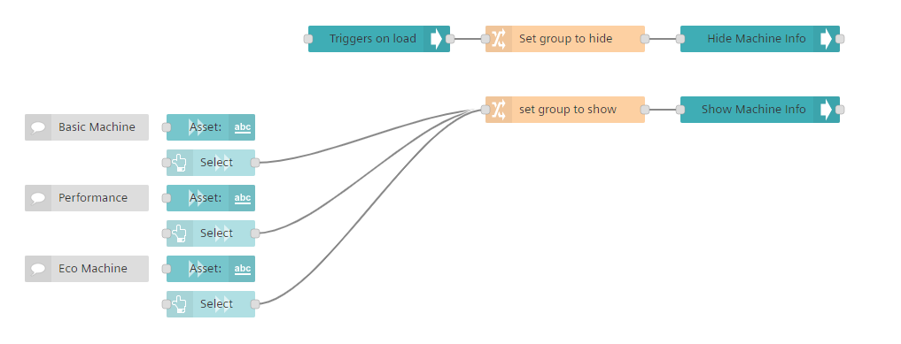

To set the *msg.payload*, you could use a *function* node or just take advantage of the *change* node. Choose the *Set* property from the dropdown and set to msg. payload to a JSON object, like this:

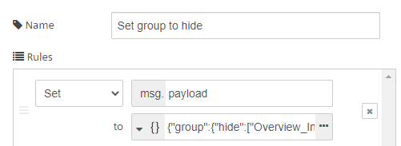

By clicking the three dots in the change, node, you can insert JSON code. Use this code to hide the *Info* group:
```JSON
{
    "group": {
        "hide": [
            "Overview_Info"
        ]
    }
}
```
And this code to show the *Info* group:
```JSON
{
    "group": {
        "show": [
            "Overview_Info"
        ]
    }
}
```
Now that we implemented that functionality, let´s give the *Info* group some content! We want to display the Software Version of the machine and a status indicator, showing the actual status of our machine. The data generator is generating a status code between 1 and five, so lets' assume:
- 1 = Status OK
- 2 = Status Information
- 3 = Status WARNING
- 4 = Status FAULT
- 5 = Status MAINTENANCE

Remember, that the *Machine_Status* is a dynamic variable and the *Software_Version* is a static attribute. So we need three *read-timeseries* nodes and three *read-aspect-static* nodes from the *mindsphere* section. Drop them in your flow and arrange them as you like. Now adjust all six *read* nodes, so they read the right data from your assets. For the three *read-timeseries* nodes choose Mode *Period* and set the Period to *2 hours* with no offset. Group them logically, like so:

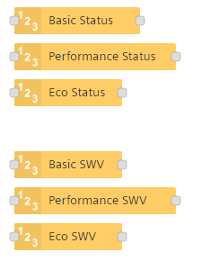

Now drop five more nodes into your flow:
- 2 *function* nodes from the *function* node section
- 2 *text* nodes from the *dashboard* node section
- 1 *led* node from the *dashboard* node section

and change the settings to the following for the first *text* node:

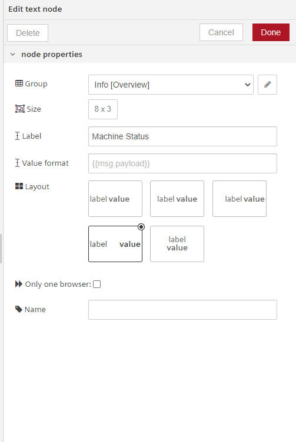

for the *led* node:

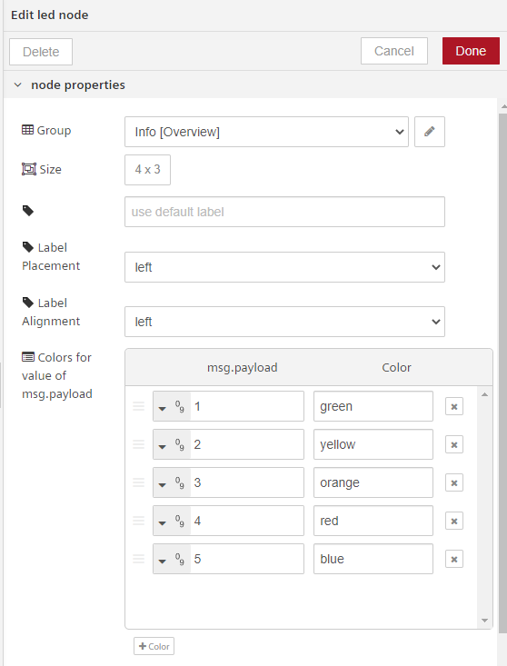

and for the second *text* node:

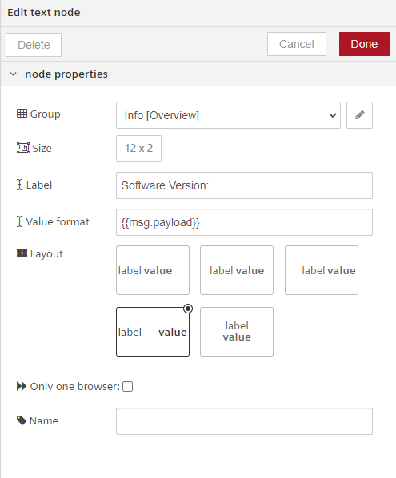

Now that these elements are set up, let's take care of the function nodes. The *read-timeseries* nodes return an array with multiple data points, but we only want to extract the latest value in this array and sent it as *msg.payload*. Name the first *function* node ***Extract Machine Status*** and the second *function* node ***Extract Software Version***. Use the following javascript code for the *Extract Machine Status* node:
```javascript
var lastDataPoint = msg.payload.slice(-1)[0];
msg.payload =lastDataPoint['Machine_Status'];
return msg;
```
and insert this code in the *Extract Software Version* node:
```javascript
msg.payload = msg.payload['Software_Version'];
return msg;
```
Next we simply have to combine the nodes:

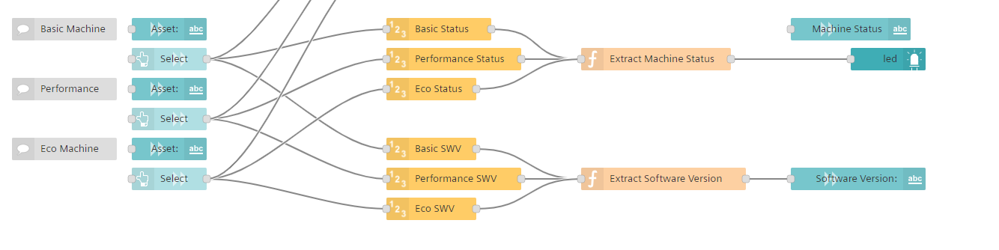

Try these new functionalities in your own dashboard. If you click on a machine, the led and Software Version should change dynamically:

https://user-images.githubusercontent.com/90254123/166253526-9b203cf0-5e0d-42ab-9dd6-360943efe8bd.mp4

Let's take a short summary. As a VFC user you have already visualized your three assets, their location and status. Now you want to take things to the next level. Imagine beeing a machine Operator, who wants to report a critical machine failure as quickly as possible directly from the dashboard. Furthermore, you want to be able to navigate to your machine and see what happened. Insights Hub offers a functionality that supports our idea, it' called **events**. So let's implement events in our dashboard. But we have to do something else first. The logic of our flow needs to know which machine is actually selected. We need to store some kind of indicator which machine is selected and we can do it in two different ways:
1. By sending the machine directly as *msg.payload* or as a *msg.xxxxx* property
2. By setting up a flow variable
When you are declaring variables in a *function* node, they are of course only valid and accessible in the respective function. Flow variables however are stored on flow level and can be used to store some data and read it again later in the flow without the need to send it in the *msg*. We now want to store our selected machine in a flow variable called *ActiveAsset*. Drop three *change* nodes and one *store ctx* node into your flow.

Configure each *change* node to only have one rule that sets the *msg.payload* to a string. The first node set's *msg.payload* to *Basic*, the second to *Performance* and the third to *Eco*. Use these settings for the *store ctx* node:

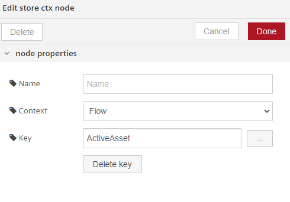

Now we will add a couple of nodes on top:
- one *button* node
- one *read ctx* node
- one *switch* node
- one *change* node
- one *ui control* node

First: the *button* node. Assign it to the *Info* Group and type *Go To Asset* in the *Label* field. Configure the *read ctx* node to *Context* = *Flow* and *Key* = *ActiveAsset*. By doing so, we will read the selected machine that was previosly stored in the *ActiveAsset* flow variable. Configure the switch node as follows:

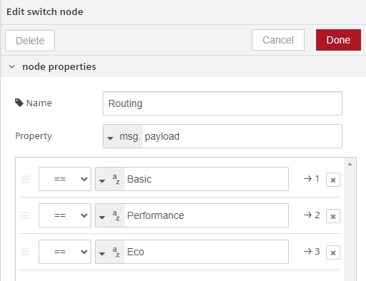

The *switch* node now has three outputs and will route the *msg* signal with the given rules. So if *msg.payload* = *Basic*, the node will send a message to the first output. With the help of the *change* node, set the *msg.payload* to detail. Let's understand the purpose of these nodes. When you click on the button *Go To Asset*, the flow reads the *ActiveAsset* flow variable and will direct the flow in a way, that the dashboard changes to a new tab; the detail page for a machine. We will create one of these detail tabs, for our *Basic* machine. Add a new tab in the *Tabs&Links* menu and name it **Detail**. Then connect the nodes like this:

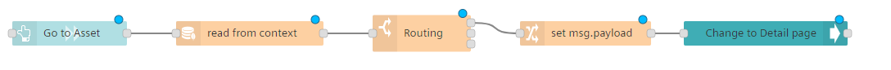

Connect the nodes to the rest of your flow and your flow should now have the following form:

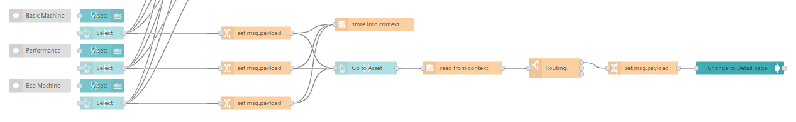

So, if you have the *Basic* machine selected and click on *Go To Asset*, you should be redirected to a new blank tab. As a control mechanism, try to click on *Go To Asset* if *Performance* or *Eco* machine is selected. Nothing should happen there, as we have not connected any nodes to these routings of the *switch* node yet. 

Now let's do the same for our emergency button. Drop these buttons in the flow and place them in the right order (from left to right):
- one *change* node
- one *button* node
- one *read ctx* node
- one *switch* node

On top of that, add three *create event* nodes and one *notification* node and place them on the right side of the flow. Let us configure the nodes together, but the logic is the same as for the tab switch. Configure the *change* node to set the *msg.payload* to a string *Critical Failure*. Assign the *button* node to the *Info* group and *Label* ist *Report emergency*. The *read ctx* node has a *Context* of *Flow* (so it can only read variables in the flow scope) and a *Key* of *ActiveAsset*. Configure the switch node in the same way as you did a few steps before:


You also have to change the settings of the *create event* nodes because you have to specify the type of event that VFC generates for you. These are the settings for the *Basic* machine:

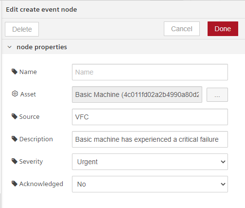

Adjust the *create event* node settings for the other two machines as well, but change the target asset and the *Description* text. Finally, take these settings for the *notification* node:

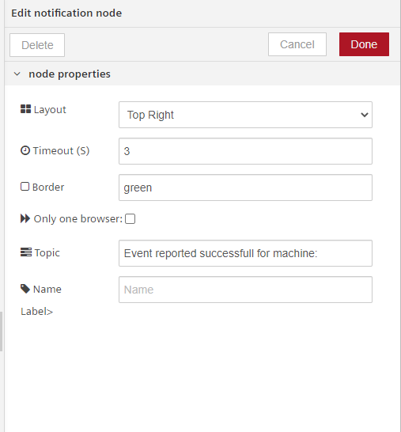

Connect the nodes to make the flow logic functional:

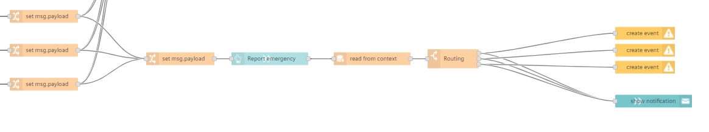

And the whole bottom part of your flow should look like this:

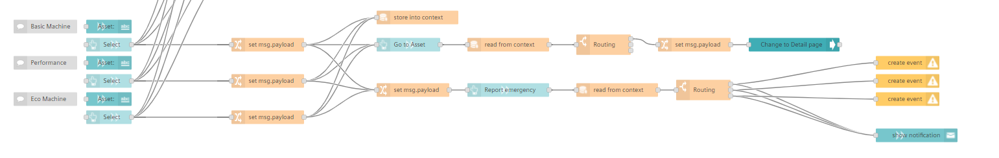

But what exactly are these nodes doing? If a machine is selected and you click on the button *Report emergency* you create an event for this machine, which is saved and bound to your asset, so you can see and use this event in the future or execute other commands dependent of the event severity. At the same time, a notification pops out in the right corner of your browser to inform you that the event was successfully created.

Now let's get this getting-started dashboard finished and implement one last feature: we want to see our events for a machine on our detail dashboard. Insights Hub offers the pre build *event table* node exactly for this purpose. Go to your *Detail* tab and create a new group called *Events* with a width of 26. Then drop the *event table* node from the *MDSP Dashboard* section in your flow and assign it to the *Events* group. Give the node a *Size* of 26 x 12. We want it to be big, to see al the details of the events. Choose the *Basic* machine in the Asset field and check these columns to show:
- [x] Severity
- [x] EntityId
- [x] Timestamp
- [x] Despriction
- [ ] Source
- [x] Acknowledged
- [x] CorrlationId
- [ ] TypeId
- [ ] Code

Then drop another *Button* node and *ui control* node in your flow. This button will take you back to the *Overview* tab. Try to configure these two nodes by yourself, so it appears on the Detail page and takes you back to the overview page when clicked.
> Hint 1: Give the *Button* node a Size of 26 x 1

> Hint 2: Send a JSON object as *msg.payload*

> Hint 3: Send
> ```JSON
> {
>    "tab": "Overview"
> }
> ```
> to change back to the Overview tab when clicked

As you can see, displaying an event table and implementing a button that chages tabs can be achieved in only three nodes:

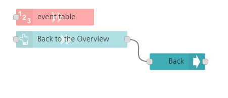

This will complete the content of this tutorial and your final flow should look something like this:

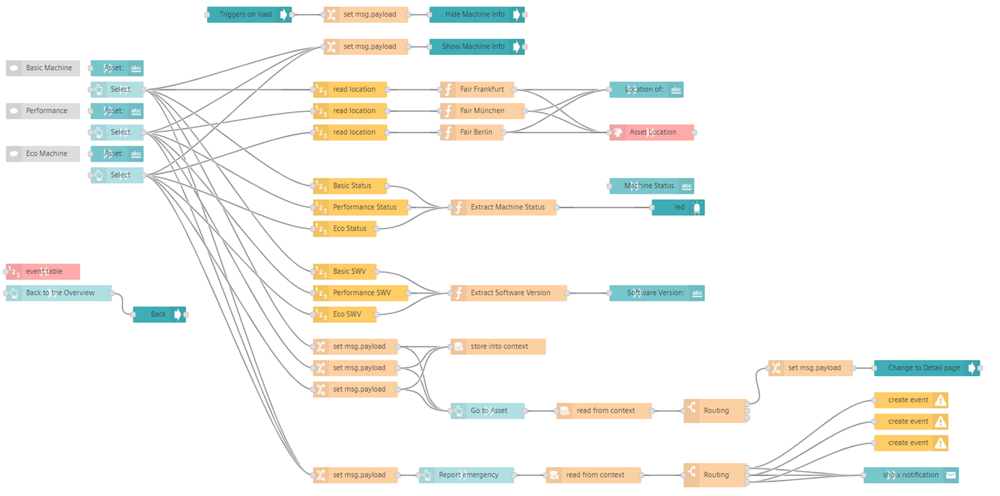

You finished your first dashboard! Check it out, try some things and experiment with creating events. As we all know, this dashboard is not perfect at all and has mainly the purpose to present different elements of VFC dashboarding. What would you do different? Now it's time to bring in your own ideas!

# Next Steps

You can extend this dashboard in many ways. See it as a starting point and add the content that you think would fit your own use case. If you are completely lost, here are some ideas what you could do:
- Add more Data to the *Info* group
- Create a detail dashboard for *Performance* and *Eco*
  1. You can create a single tab for each machine
  2. Or you can combine the three machines in one tab by creating a dynamic data layer
- Implement a security check when creating an event (e.g.: Do you really want to create this event? Yes, No)
- Alarm people automatically when an event is triggered
- Design a dynamic text input for the triggered event
- . . .

# Questions and Answers
Feel free to ask your questions in the [Insights Hub Developer Forum](https://community.sw.siemens.com/s/topic/0TO4O000000MihsWAC).

Or open an [issue](https://github.com/mindsphere/vfc-examples/issues) if you find a bug in our examples.

You want to contribute? Your pull request is always welcome!!!

