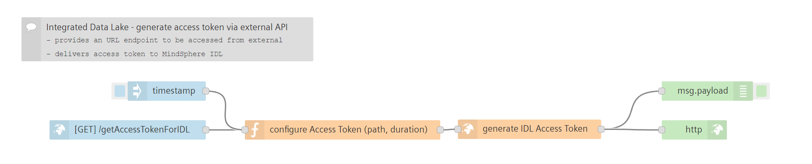
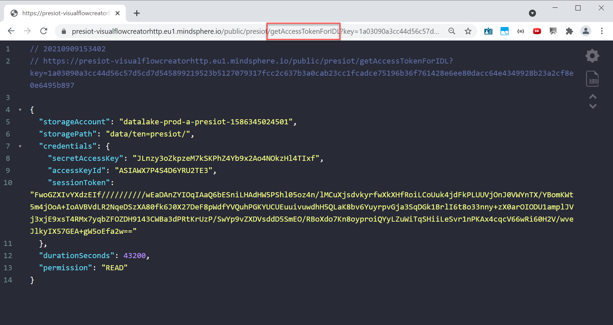

# Provide Access Token for Integrated Data Lake via API
<!-- (mandatory) Insert a description for the example flow. Describe the use case or its specialty. -->
This small flow triggers sets up an API endpoint which can be called from external system to get an access token to Insights Hubs' Integrated Data Lake. 

<!-- Insert an example image -->

## Prerequisites
<!-- (optional) Describe prerequisites other than VFC to make this flow work -->
- Integrated Data Lake 
  
## Setup & Configuration
1. Import the flow in Visual Flow Creator
2. Specify the API endpoint where the access token should be accessed via, e.g. `/getAccessTokenForIDL` in the HTTP-IN node (blue)
3. In the function node *configure Access Token* specify
   - Path inside your Integrated Data Lake where the access should be granted to (`path`)
   - Duration - how long should the token be valid (`durationSeconds`)
   - Permission to allow read or delete access to the path (`permission`) in the data lake for your files
4.  Save the flow 

:cloud: :heavy_check_mark: You're ready ... - enjoy!

## How does this flow works
The function delivers the body for the API request against the `/api/datalake/v3/generateAccessToken` endpoint. From here, the Access Token is provided and feedback to the user via the `http`-Node

## Result
Once the API endpoint is accessed, the user is presented with a JSON response containing the Access Token for IDL.  
This can then be used in native S3-Tools to be worked with and connect to the IDL:
<!-- markdown-link-check-disable-next-line -->
In this example, calling the full API endpoint https://presiot-visualflowcreatorhttp.eu1.mindsphere.io/public/presiot/getAccessTokenForIDL?key=1a03090a3cc44d56c57d5cd7d545899219523b5127079317fcc2c637b3a0cab23cc1fcadce75196b36f761428e6ee80dacc64e4349928b23a2cf8e0e6495b897 results in a JSON response like shown below.

## See also
- [:shopping_cart: Insights Hub Store: Integrated Data Lake](https://www.dex.siemens.com/mindsphere/mindaccess/integrated-data-lake-essential)
- [Developer Documentation: Integrated Data Lake Service](https://developer.mindsphere.io/apis/iot-integrated-data-lake/api-integrated-data-lake-overview.html)

