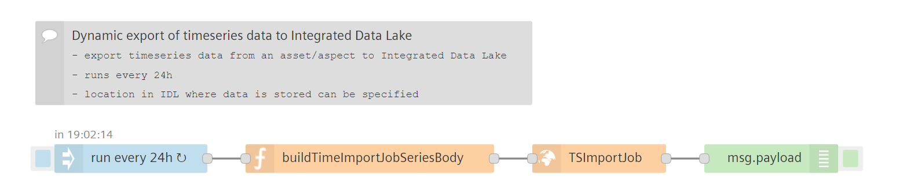
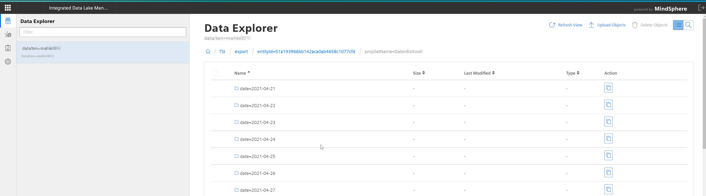

# Scheduled Import of Timeseries Data to Integrated Data Lake
<!-- (mandatory) Insert a description for the example flow. Describe the use case or its specialty. -->
This small flow triggers the import of timeseries data to the Integrated Data Lake for further usage. 

<!-- Insert an example image -->

## Prerequisites
<!-- (optional) Describe prerequisites other than VFC to make this flow work -->
- Integrated Data Lake 
  
## Setup & Configuration
1. Import the flow in Visual Flow Creator
2. In the function node *buildTimeImportJobSeriesBody* specify
   - Asset (`assetIds`)
   - Aspect (`aspectNames`)
   - Output destination (`destination`) in the data lake for your files
   - [optional] specify a name for the import job based on your needs
3.  Save the flow 

:cloud: :heavy_check_mark: You're ready ... - enjoy!

## How does this flow works
The IDL endpoint to trigger the import job (from timeseries storage to IDL) is used and
- asset 
- aspect
- directory of export
can be configured in the flow. 

## Result
After the data import was triggered via the flow and once the import job is finished, the data from timeseries storage can be found in the data lake. 
The IDL Explorer helps to browse the file structures. 

## See also
- [:shopping_cart: MindSphere Store: Integrated Data Lake](https://www.dex.siemens.com/mindsphere/mindaccess/integrated-data-lake-essential)
- [Developer Documentation: Integrated Data Lake Service](https://developer.mindsphere.io/apis/iot-integrated-data-lake/api-integrated-data-lake-overview.html)

