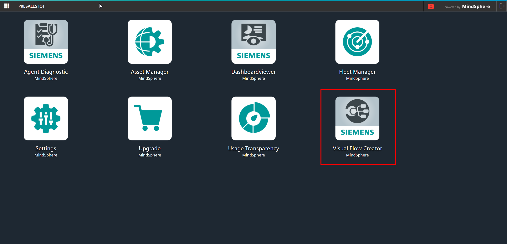
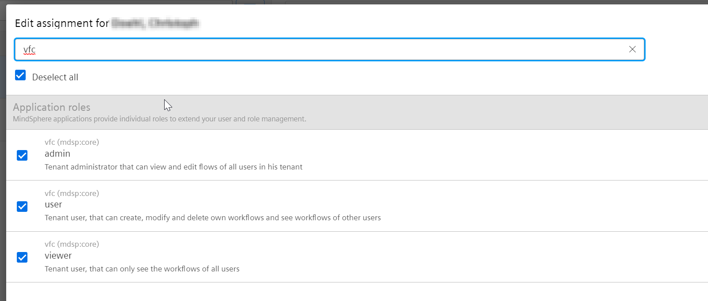
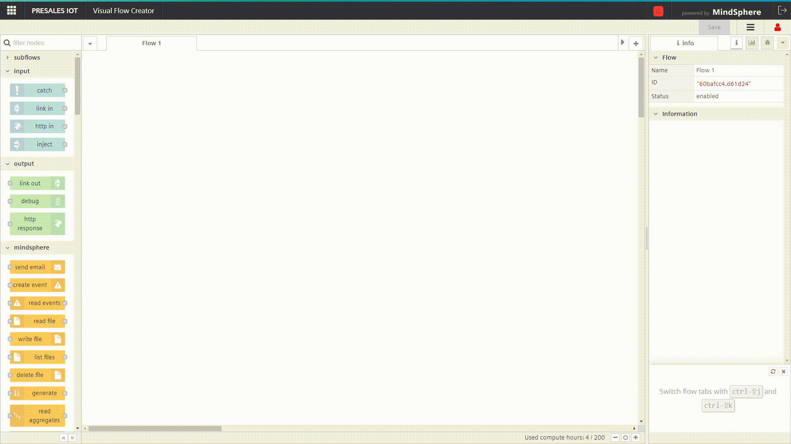

# MindSphere Visual Flow Creator Examples

# Welcome
* You are interested in MindSphere?
* You want to know, what you can do with it?
* You've heard about Visual Flow Creator and want to try it out?
* You know already Visual Flow Creator but search for examples?
* You want to get inspired by other flows from the community?

This repository provides example flows to be used in MindSphere Visual Flow Creator (VFC). You can use them and try it out to get an impression what is possible. Additionally you can customize them to your use cases. And of course you can contribute to this repository and share your knowledge to others.

If you do not have already purchased the app, you can get it in the [MindSphere Store](https://www.dex.siemens.com/mindsphere/applications/Visual-Flow-Creator). Or if you do not already have a MindSphere account, get one at [MindSphere Start](https://www.mindsphere.io/start).

## How does this work

In the next chapter you will find example flows. There is always a readme with a short description, what this flow does.
There is an image showing the flow to get an impression of the complexity.

And there is the most important thing - the json file, which you can import as a new flow into your Visual Flow Creator.

Please note, that the json-files are exported from another tenant. So their might be fields which you have to adapt, that the flow is able to run in your tenant.

## Example Overview

### Current examples in this repository for Visual Flow Creator (VFC):

| Name | Description | Complexity Rating | Prerequisites |
| --- | --- | --- | --- |
| [Command MQTT devices connected via IoT Extension](./commandMqttDevice/readme.md) | | :star: :star: | IoT Extension|
| [Create custom API endpoints](./createCustomEndpoint/readme.md) | | :star: | - |
| [Create rule for asset type](./createRuleForAssetType/readme.md) | Create a rule for all assets of this type | :star: | - |
| [Data Lake - timeseries import](./DataLake_scheduledImport/readme.md) | Setup scheduled trigger to start import of data from timeseries storage to Integrated Data Lake | :star: | Integrated Data Lake |
| [Data Lake - generate access token](./DataLake_provideAccessToken/readme.md) | Provides an API endpoint which feedbacks an access token for IDL data | :star: | Integrated Data Lake |
| [Generate sample data](./generateSampleData/readme.md) | Demo data for different data types in MindSphere | :star: | - |
| [Send SMS notifications](./sendSmsNotifications/readme.md) | Send SMS notifications and dynamically specify recipient | :star: | - |
| [Trend Prediction Example](./trendPredictionAPI/readme.md) | Application example which shows how to use trend prediction service to forecast timeseries data | :star: | - |
| [Virtual machine simulator](./virtualMachineSimulator/readme.md) | | :star: | - |
| [Write location data to your Asset](./WriteLocationToAsset/readme.md) | Write locational information directly to your Asset using the Asset Management API | :star: | - |
| [VFC Dashboard - Getting Started Guide](./Dashboard_Getting_Started/readme.md) | Create a dynamic Dashboard completely from scratch and learn the basics of VFC Dashboarding | :star: - :star::star: | - |

### Examples which have to be added:
| Name | Description | Complexity Rating | Prerequisites |
| --- | --- | --- | --- |
| [IN PROGRESS: Set Flow variables via dashboard](./setFlowVariablesViaDashboard/readme.md) | | :star: | |
| [TODO: Create dashboard for Fleet Manager](./createDashboardForFleetManager/readme.md) | | :star: | |
| [TODO: Integrate external API](./integrateExternalApi/readme.md) | | :star: | |
| [TODO: Dashboard with dynamic data layer](./dynamicDashboards/readme.md) | | :star: :star: | |

You can add here your ideas or requests for further examples.

### Example template
You want to create your own example? Just copy the [template flow-directory](./templateFlow/), adapt it and send us your pull request.
## Remarks
Please note that the screenshots show just the current state, when these examples have been created. They might differ to the latest software release.

Each flow has to be adapted to your tenant. Ensure, that e.g. fixed tenant names or asset ids are adapted before/after you import the flow.

## Prerequisites
All application examples shown in this repository require the MindSphere Application *Visual Flow Creator (VFC)*. 

To use them, ensure that
- VFC is available in your MindSphere tenant ([VFC in MindSphere Store](https://www.dex.siemens.com/mindsphere/applications/visual-flow-creator))

- you have *admin* or *user* access to VFC ([VFC user role settings](https://documentation.mindsphere.io/resources/html/visualflow-creator/en-US/108812512779.html))

If you can see Visual Flow Creator on your Launchpad, you're ready to start developments. 

## Import of Examples

- To import any of the examples shown in this repository, launch the VFC. 
- In the menu, select *Import* and paste the JSON template as found in the application examples. 
- Drop the nodes in the editor and save the just imported flow.

## Questions and answers

Feel free to ask your questions in the [MindSphere Developer Forum](https://community.sw.siemens.com/s/topic/0TO4O000000MihsWAC).

Or open an [issue](https://github.com/mindsphere/vfc-examples/issues) if you find a bug in our examples.

You want to contribute? Your pull request is always welcome!!!
