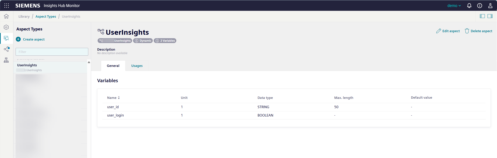
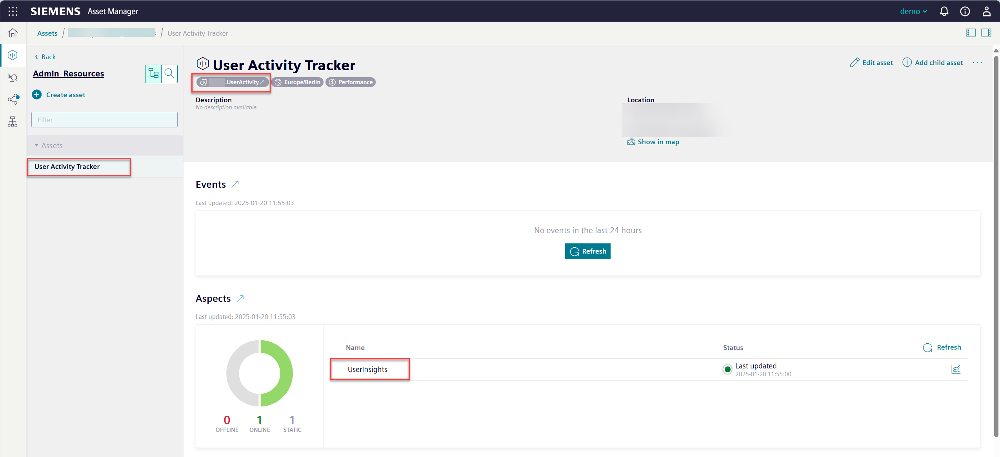

# User Activity Tracker

This flow monitors and tracks user login activities by collecting last login timestamps for all users. The flow automatically runs daily and stores the login data in a dedicated asset for historical analysis and tracking of user engagement patterns. Additional analysis for the login behaviour are then possible based on this data source. 

## Prerequisites
- Access to Visual Flow Creator
- Permissions to create assets and aspects in Asset Manager

## Setup & Configuration

1. Create the required asset structure in Asset Manager:
   - Create a new **Aspect** named "UserInsights" (or any custom name) with exaclty these parameters:    
     | Variable Name | Data Type |
     |--------------|-----------|
     | user_login   | BOOLEAN   |
     | user_id      | STRING    |
   - Create an **Asset Type** that includes this aspect
   - Create an **Asset** from this asset type
   - Note down the **Asset ID** for configuration of the flow later  
     (you can find this ID for example in the URL of your browser)

2. Import the flow in Visual Flow Creator using the [Flow Tempalte](template.json)
   
3. Configure the flow by:
   - Locate the "CONFIG" function node
   - Update the `assetId` variable with your created asset's ID
   - Update the `aspectName` variable if you used a custom aspect name

4. Save the flow 

### Additional Setup Information

Below are the visual references for the required setup in Asset Manager. 
1. Create the Aspect "UserInsights":

*Creating the `UserInsights` Aspect with required variables*

2. Create the Asset Type:

*Creating an `UserActivity` Asset Type that includes the `UserInsights` Aspect*

3. Create the Asset:

*Final asset based on the `UserActivity` Asset Type with `UserInsights` Aspect which will received the data from the flow*

:cloud: :heavy_check_mark: You're ready to track user login behavior!

## How does this flow work

1. The flow triggers automatically every 24 hours at 02:00 UTC
2. It fetches the data from the User Management API to retrieve all user information
3. For each user, it processes:
   - Last login timestamp
   - Identifies users who haven't logged in for over 365 days
   - Identifies users who have never logged in
4. The processed login data is written to the configured asset with timestamps showing the login time of the user
5. Inactive users (>365 days) and never-logged-in users are reported to the VFC console to enable further follow-up

> Note:  
> The flow uses pagination to handle large user lists and includes error handling for robust operation. This might lead to an increased use of compute hours and flow duration.

## Result

The flow generates:
- Historical login data for each user stored in the asset
- Console notifications for:
  - Users who haven't logged in for over 365 days
  - Users who have never logged in
- Time-series data showing login patterns over time

## See also
- [Visual Flow Creator Documentation](https://documentation.mindsphere.io/MindSphere/apps/visual-flow-creator/introduction.html)
- [Identity Management API Documentation](https://documentation.mindsphere.io/MindSphere/apis/core-identitymanagement/api-identitymanagement-overview.html)

