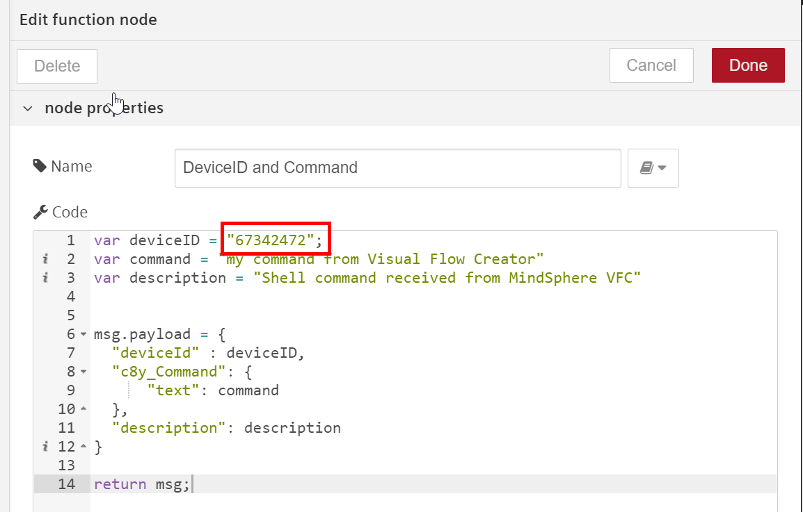
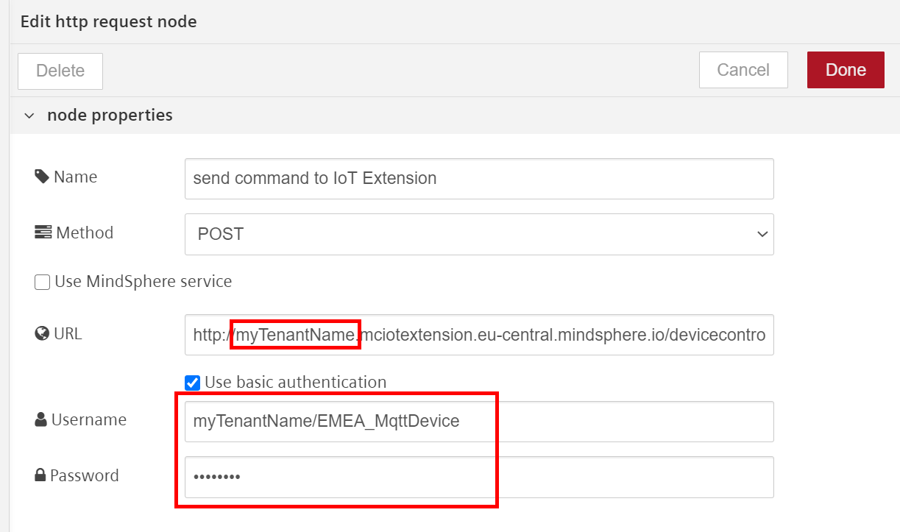
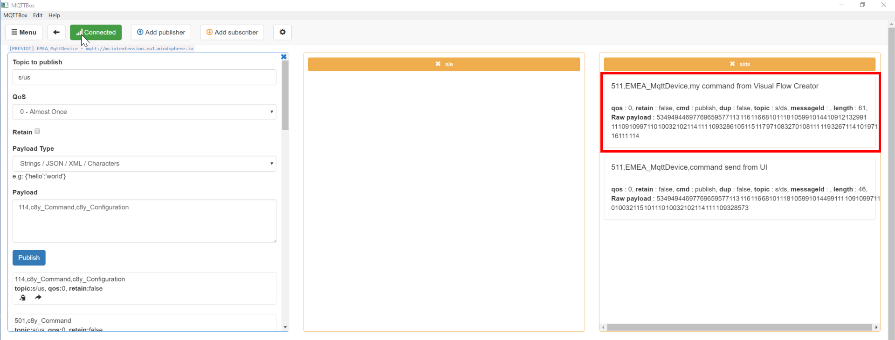
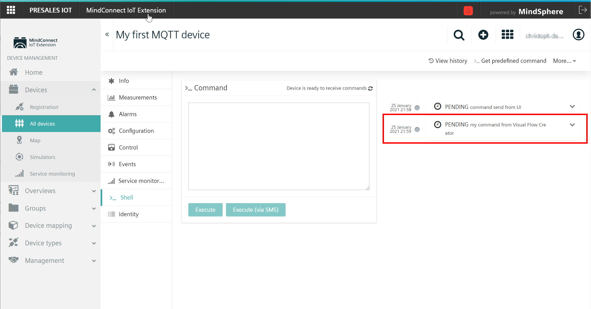

# Command device via MQTT

This flow demonstrates how you can use Visual Flow Creator to trigger sending of a command to a device connected to Insights Hub via IoT Extension and MQTT protocol.  
Every time the flow is triggered, the command specified in the payload is send to the device linked using the device-ID.


## Prerequisites
- Access to Visual Flow Creator
- Access to IoT Extension

## Setup & Configuration

### Setup in IoT Extension
1. Create a device account to be used from IoT Extensions manually ([see Manage users](https://documentation.mindsphere.io/MindSphere/apps/mindconnect-IoT-extension/account-managing-users.html)) or via the [Device Integration](https://cumulocity.com/guides/device-sdk/rest/#device-integration) process for automatically obtained device credentials. Note that you will need this credentials later in VFC as well. 
2. Connect to IoT Extension via your MQTT client of choice. The detailed process is described [here](https://documentation.mindsphere.io/MindSphere/howto/howto-mqtt-mciot.html)
3. Follow the process to [create your MQTT device](https://cumulocity.com/guides/device-sdk/mqtt-examples/#hello-mqtt) by sending ```100,My first MQTT device,MqttDeviceType``` to ```s/us``` topic. Once you can see the device showing up in your device list, you're ready for the next step. 
   
4. Enable [receiving operations](https://cumulocity.com/guides/device-sdk/mqtt-examples/#receiving-operations) for the device by sending the following payload ```114,c8y_Command,c8y_Configuration``` to ```s/us```. In your device view, you should then see the *Shell* option to show up after reloading the website. 
  
5. Subscribe to ```s/ds``` topic on the device to see the commands send
6. Test the device setup by sending a command through the IoT Extension UI in the *Shell* window. Onc you receive the command on the device send from the browser, you're ready to automate this via VFC in the next step. 

### Setup in Visual Flow Creator
1. Import the flow in Visual Flow Creator
2. Adjust the payload body in the function node
    - specify ```deviceID``` as seen in IoT Extension overview page
    - set the ```command``` you want to send to the device
      
3. In the *http request* node 
   - change the URL to your tenant name
   - enable basic authentication 
   - use the device credentials you used earlier to also connect the device
   
4.  Save the flow 

:cloud: :heavy_check_mark: You're ready to command a device once the flow is triggered - enjoy!


## Result
Once the flow is executed, the device will receive on ```s/ds``` topic the command as specified in the VFC flow. 
Follow the device logic to now acknowledge this command and use it for your application needs further on the device.  
**Device-View**

**Platform-View**


## See also
- [Integrate an MQTT Device via IoT Extension](https://developer.mindsphere.io/howto/howto-mqtt-mciot.html)
- [Device Control for IoT Extension](https://cumulocity.com/guides/reference/device-control/)
- [GitHub: Cumulocity MQTT client examples](https://github.com/SoftwareAG/c8y_hw_mqtt)
- [:shopping_cart: Store: Visual Flow Creator](https://www.dex.siemens.com/mindsphere/applications/visual-flow-creator?viewState=DetailView&cartID=&portalUser=&store=&cclcl=en_US)
- [:shopping_cart: Store: IoT Extension](https://mindsphere.io/store)


