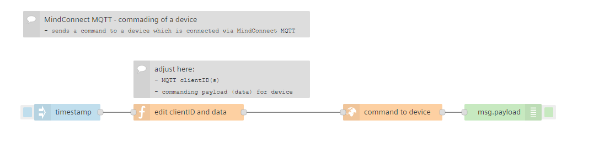
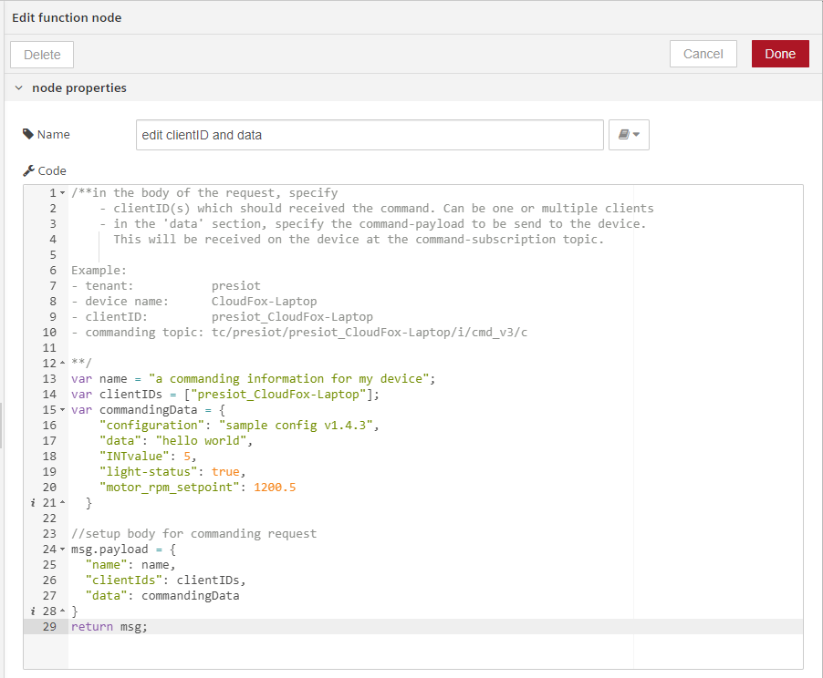
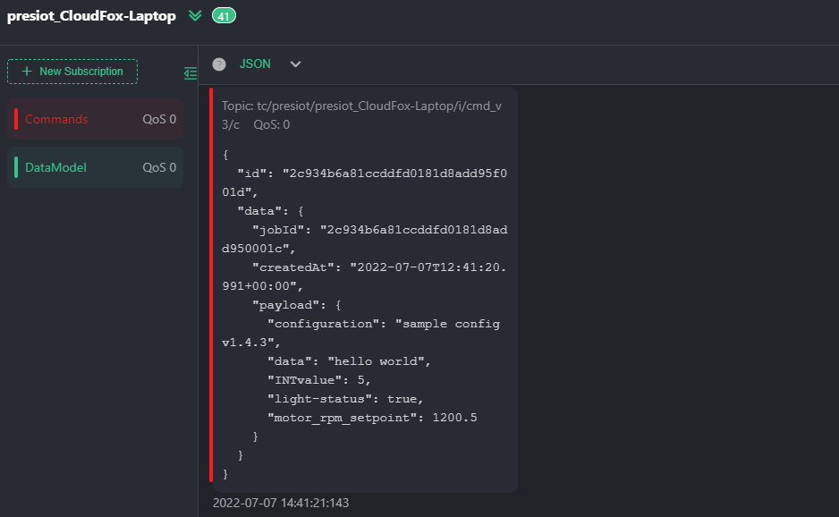

# Command device via MindConnect MQTT

This flow demonstrates how you can use Visual Flow Creator to trigger sending of a command to a device connected to Insights Hub via [MindConnect MQTT](https://documentation.mindsphere.io/MindSphere/howto/howto-mindconnectmqtt-commanding.html) protocol.  
Every time the flow is triggered, the command specified in the payload is send to the device linked using the client-ID of the connect MQTT client.  


## Prerequisites
- Access to Visual Flow Creator
- a device connected to Insights Hub via MindConnect MQTT

## Setup & Configuration

### Setup your MQTT device
Creation and connection of a device via MindConnect MQTT is not further described in this document. The core element to do so, are to be found on the Insights Hub Developer Website.  
In order to use this feature, make sure you have successfully completed step 1 - 3. 
  1) [Onboarding MindConnect MQTT Agent](https://documentation.mindsphere.io/MindSphere/howto/howto-onboard-mindconnect-mqtt.html)
  2) [Creating Data Model from MQTT Agent](https://documentation.mindsphere.io/MindSphere/howto/howto-create-data-model-mqtt-agent.html)
  3) [Sending Data from MindConnect MQTT Agent](https://documentation.mindsphere.io/MindSphere/howto/howto-send-data-from-mqtt-agent.html)

### Usage of commanding
Once your device is connected to Insights Hub, you can start using the [MindConnect MQTT Commanding](https://documentation.mindsphere.io/MindSphere/howto/howto-mindconnectmqtt-commanding.html) feature.  
Commanding can be initiated via a dedicated API. Here we will use VFC to initiate the API call and request the commanding. 

### Setup in Visual Flow Creator

#### Using standard nodes for "MindConnect"
A dedicated commanding node was added to the standard nodes of Visual Flow Creator.  
https://documentation.mindsphere.io/MindSphere/apps/visual-flow-creator/mindconnect-nodes.html#command-mindconnect

Manual configuration towards the API endpoint for commanding is no longer needed but still shown in depth in the description below. 
With "MindConnect" nodes, you can send a command to MindConnect MQTT device and check the status of the sent command. For more information about MindConnect Elements, refer to [Connectivity](https://documentation.mindsphere.io/MindSphere/connectivity/overview.html).


#### Manually setting up the API call
1. Import the flow in Visual Flow Creator
2. Adjust the payload body in the function node
    - ```name``` defines an internal name for the job to be send to the devices.
    - ```clientIds``` which should receive the command. Note that this can be 1-* devices (one, or multiple clients).
    - set the ```data``` you want to send to the device. This can be a JSON schema with multiple settings/information/commands. A few examples are shown below. 
      ```JSON
      msg.payload = {
      "name": "a commanding information for my device",
      "clientIds": [
            "presiot_CloudFox-Laptop"],
      "data": {
         "configuration": "sample config v1.4.3",
         "data": "hello world",
         "INTvalue": 5,
         "light-status": true,
         "motor_rpm_setpoint": 1200.5
      }
      }
      ```

      
3.  Save the flow 

:cloud: :heavy_check_mark: You're ready to command a device once the flow is triggered - enjoy!


## Result
Once the flow is executed, the device will receive on ```tc/<tenantName>/<ClientID>/i/cmd_v3/c``` (general schema) topic the command as specified in the VFC flow. Make sure that you have subscribed to this topic before the flow is being triggered. 
Follow the device logic to now acknowledge this command and use it for your application needs further on the device.  
 
**Device-View**
The following is received at the device on the subscribed topic, given the following setup  
| parameter | value | 
| --- | --- |
| tenant | presiot |
| device-name | CloudFox-Laptop |
| *clientID* | *presiot_CloudFox-Laptop* |
| *commanding topic* | *tc/presiot/presiot_CloudFox-Laptop/i/cmd_v3/c* |

> **_NOTE:_** The parameters written in *italics* are defined automatically based on tenant and device-name



## See also
- [Insights Hub MindConnect MQTT Broker - API specs](https://documentation.mindsphere.io/MindSphere/concepts/concept-mindsphere-mqtt-broker.html)
- [Insights Hub MindConnect MQTT Broker - How To section](https://documentation.mindsphere.io/MindSphere/concepts/concept-mindsphere-mqtt-broker.html)
  


