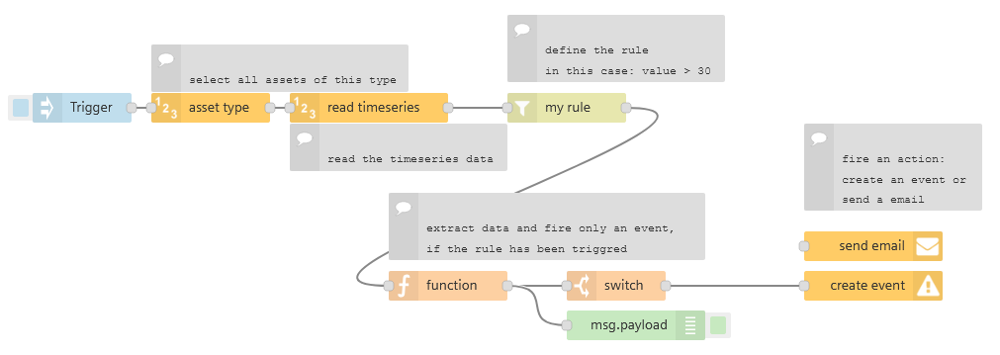

# FLOW: Create rule for assets of a specific asset type

You might created a flow where you monitor a single variable for a defined condition. But how can you simply roll this out to all assets of this type without much effort? Just use the `asset type`-node and try the following example.

# Example image

# How to

- Import the flow in Visual Flow Creator
- Double click the asset type node and select an asset type in your tenant

# How does this flow works

- the flow is triggered by the inject node 
- with the `asset type` node VFC will get all assets of a specific type and perform the action for all assets of this type
- you can also disable specific assets, that they are not used
- for all of this assets a rule is checked and an email can be sent or a Insights Hub event can be created
