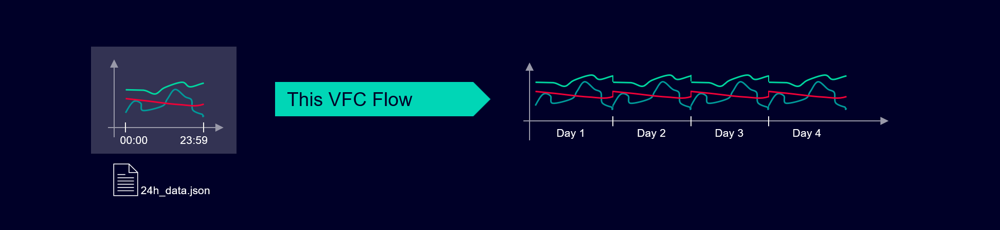
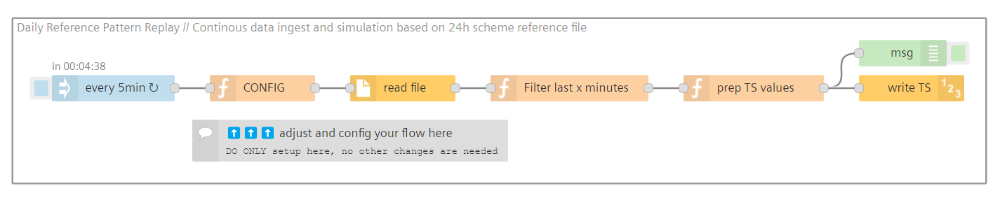
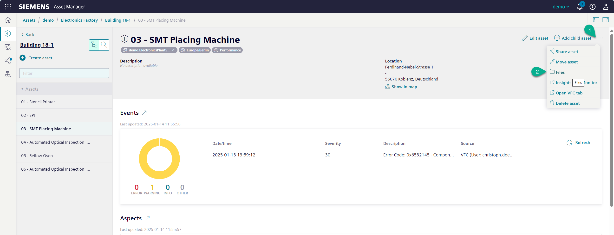
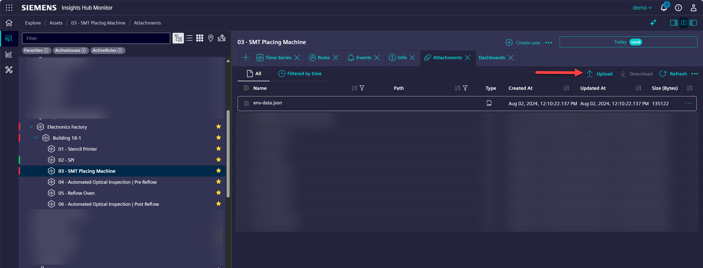

# 24-hour Data Simulation Pattern Replay

This flow creates a continuous data simulation by automatically repeating a 24-hour reference dataset.
It transforms a single day's worth of sample data into an ongoing simulation pattern, making it perfect for industrial testing and monitoring scenarios.

The diagram below illustrates the underlying logic:


Here's the Visual Flow Creator (VFC) implementation:


**Contents**  
- [24-hour Data Simulation Pattern Replay](#24-hour-data-simulation-pattern-replay)
  - [Prerequisites](#prerequisites)
    - [Reference Data File Structure](#reference-data-file-structure)
    - [Reference File Storage](#reference-file-storage)
  - [Setup \& Configuration](#setup--configuration)
  - [How It Works](#how-it-works)
  - [Results](#results)
  - [Additional Resources](#additional-resources)
## Prerequisites

### Reference Data File Structure

Your reference file must contain timestamps (`_time`) and all variables defined in the Aspect. The timestamps must meet these requirements:

- All timestamps must be from the same day
- Data must span the full day (from `00:00` to `23:59`)  

You can customize the data sampling frequency (e.g., every 1 minute or 15 minutes) based on your needs. Important: Ensure your simulation schedule matches your reference data frequency. For example, if your reference data has 15-minute intervals but your flow runs every 5 minutes, some executions won't generate new data.

```json
   [
    {
        "_time": "2024-07-29T00:00:00.000000Z",
        "temperature": 24.77,
        "humidity": 42.02,
        "pressure": 979.1
    },
    {
        "_time": "2024-07-29T00:01:00.000000Z",
        "temperature": 24.77,
        "humidity": 42.02,
        "pressure": 979.1
    },
    ...
    {
        "_time": "2024-07-29T23:59:00.000000Z",
        "temperature": 29.73,
        "humidity": 46.08,
        "pressure": 982.2
    }
   ]
   ```

### Reference File Storage

Upload your JSON reference file (containing 24 hours of sample data) directly to the asset. You have two options:

1. Via Asset Manager:

2. Via Monitor:


## Setup & Configuration

1. Import the provided flow into Visual Flow Creator
2. Update the CONFIG node with your specific parameters:

   ```javascript
   var assetId = "your-asset-id";           // Target asset identifier
   var aspectName = "your-aspect-name";     // Aspect to simulate
   var filename = "your-file.json";         // Reference data filename
   var simulatorRun = 5;                    // Simulation interval (minutes)
   ```

3. Verify that your reference file is available at the specified asset location
4. Deploy the flow
5. Save your configuration

:cloud: :heavy_check_mark: Your simulation is now ready to run!

## How It Works

1. The flow activates at specified intervals (default: every 5 minutes)
2. Retrieves the reference data from your asset
3. Selects relevant data points based on the current time and last execution
4. Adjusts timestamps to match the current day while maintaining the original time patterns
5. Uploads the updated data to timeseries storage

## Results

- Seamless, continuous data pattern simulation
- Preserved time intervals between data points
- Consistent daily pattern reproduction
- Automatic timestamp updates
- Hands-free operation once configured

## Additional Resources

- [Industrial IoT - Insights Hub Documentation](https://documentation.mindsphere.io/resources/html/iot-hub/en-US/index.html)
- [Visual Flow Creator Documentation](https://documentation.mindsphere.io/resources/html/visual-flow-creator/en-US/index.html)
