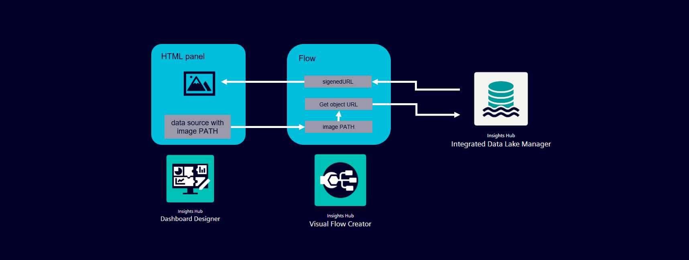
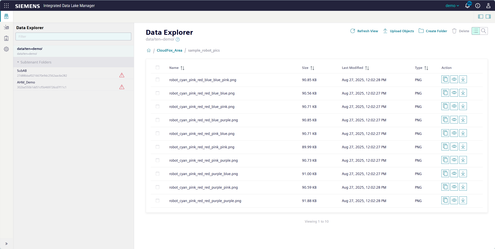
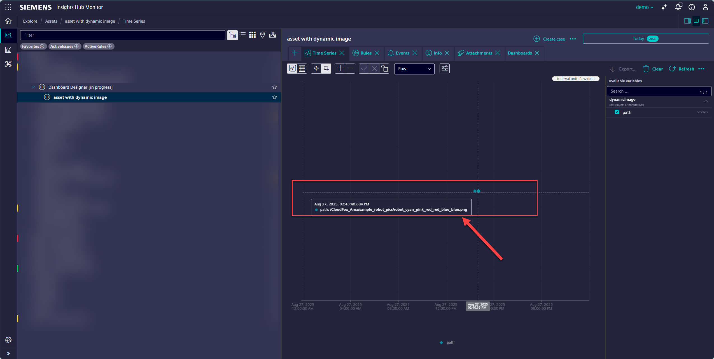
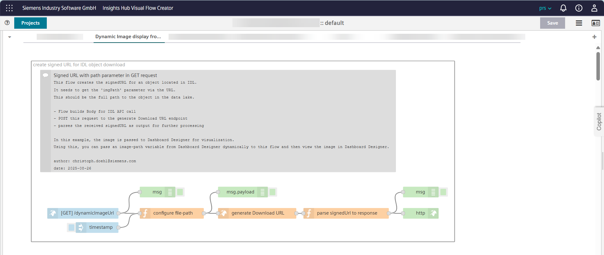
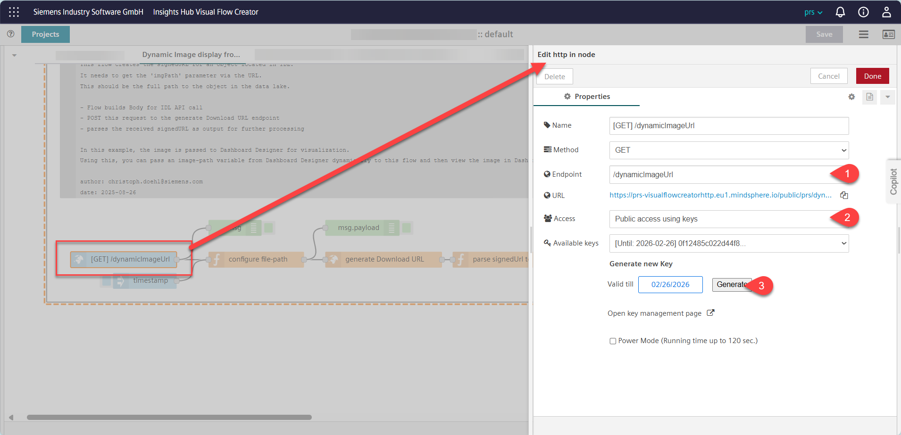
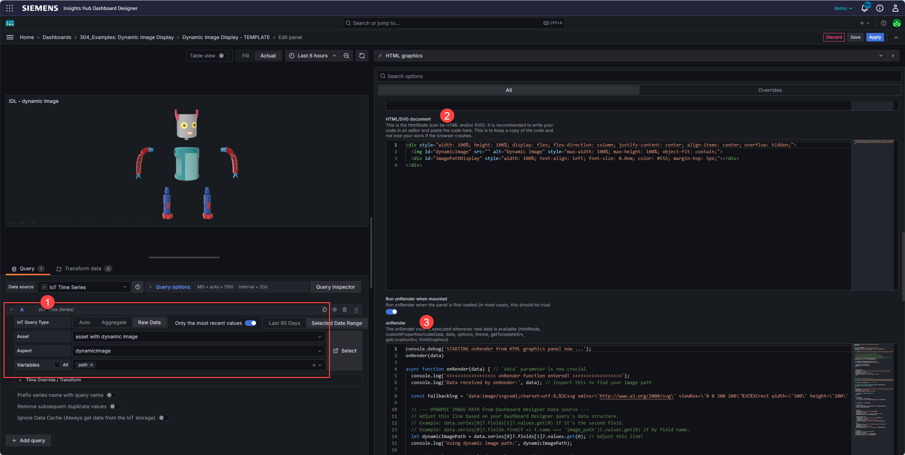
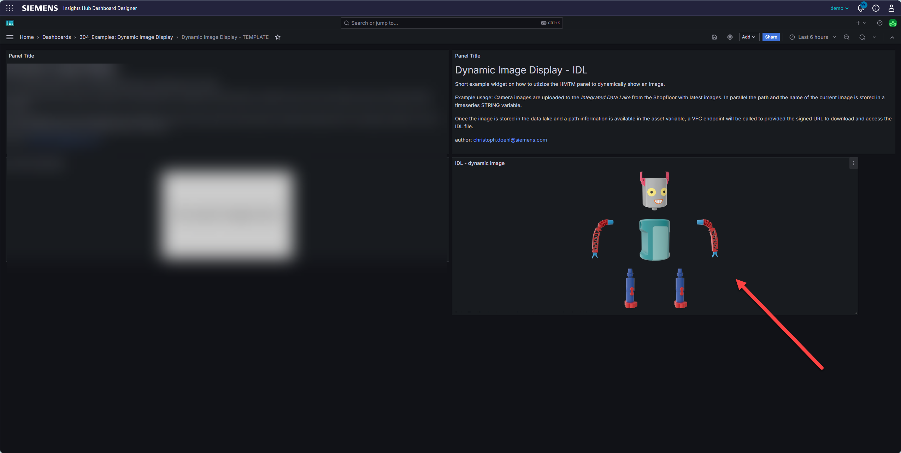

# Dynamic Image Display in DD from IDL 

*Dynamic Image Display from Integrated Data Lake (IDL) in Dashboard Designer via Visual Flow Creator (VFC)*


This solution demonstrates how to dynamically display images stored in Insights Hub's Integrated Data Lake (IDL) within a Dashboard Designer panel. It leverages a Visual Flow Creator (VFC) flow to securely generate pre-signed URLs for Integrated Data Lake objects, which are then consumed by a custom HTML panel in Dashboard Designer. This approach allows for flexible image display, either by hardcoding an image path or by passing it dynamically from Dashboard Designer data sources.




## Prerequisites

*   Access to an Insights Hub tenant with **Visual Flow Creator (VFC)** editor rights.
*   Access to **Integrated Data Lake (IDL)** with images stored (e.g., `/my_images/qualityImage-1.png`).
*   Access to **Dashboard Designer** with editor rights.
*   
## Resources
*   The VFC Flow JSON (see, `VFC_Flow-template.json`).
*   The HTML panel:
    *   HTML code
    *   JavaScript 

## Setup & Configuration

Follow these steps to get the dynamic image display working:


### 0. Images in IDL and path in Asset
The data foundation for this use-case are 
- images stored in IDL for usage
- a "path" information in an asset that relfects the image to be shown. 

The asset always contains the full path to the latest image that should be shown on the dashboard. 
This path is later on used in the request to IDL via VFC to obtain the image as object.  
*Sample Images in Integrated Data Lake*


*Image path information in Asset-Model*



### 1. Visual Flow Creator (VFC) Flow Setup

1.  **Import the flow** in Visual Flow Creator using the provided Flow JSON (`VFC_Flow-template.json`).
2.  **Configure the HTTP In Node:**
    *   Define an endpoint name (e.g., `/dynamicImageUrl`). This will form part of your API URL (e.g., `https://<yourTenantId>-visualflowcreatorhttp.eu1.mindsphere.io/public/<yourTenantId>/dynamicImageUrl`).
    *   Ensure the node is configured to accept `GET` requests.
    *   **Authentication:** Create a secret as a key to access this endpoint in the HTTP-IN node. Note that this secret can expire and needs to be renewed periodically. Copy this key, as it will be used in the Dashboard Designer JavaScript.
    *   The flow expects an `imgPath` parameter in the URL (e.g., `.../dynamicImageUrl?key=<your_key>&imgPath=/full/path/to/IDL-object.png`).

> **_NOTE:_**  The only thing needed in the HTTP-IN node should be the generation of the access code. The rest can remain as it is provided by the template. Adjustments only needed for customizations (e.g. other endpoint name).

53.  **Save & Deploy** the VFC flow.



Sample configuration of the HTTP-IN node configuration. 



### 2. Dashboard Designer HTML Panel Setup

1.  **Add a new "HTML" panel** to your Dashboard Designer dashboard.
2.  Go to the **"HTML" tab** in the panel options and paste the following HTML structure:

    ```html
    <div style="width: 100%; height: 100%; display: flex; flex-direction: column; justify-content: center; align-items: center; overflow: hidden;">
      
      <div id="imagePathDisplay" style="width: 100%; text-align: left; font-size: 0.8em; color: #555; margin-top: 5px;"></div>
    </div>
    ```

3.  Go to the **"JavaScript" section** and paste the `onRender` function code. There are two main ways to configure the image path:

    #### Option A: Hardcoded Image Path (Simpler for fixed images)

    Use this JavaScript if the image you want to display is always the same.

    ```javascript
    console.debug('STARTING onRender from HTML graphics panel now ...');

    // The onRender function is correctly defined as async here.
    onRender(); // This call might be redundant if Dashboard Designer calls onRender directly

    async function onRender(data) { // 'data' parameter is still passed by Dashboard Designer but not used for imagePath in this option
      console.log('<<<<<<<<<<<<<<<<<< onRender function entered! >>>>>>>>>>>>>>>>>>');
      console.log('Data received by onRender (not used for image path in this version):', data); 

      const fallbackSvg = 'data:image/svg+xml;charset=utf-8,%3Csvg xmlns=\'http://www.w3.org/2000/svg\' viewBox=\'0 0 300 200\'%3E%3Crect width=\'300\' height=\'200\' fill=\'%23cccccc\'/%3E%3Ctext x=\'50%25\' y=\'50%25\' dominant-baseline=\'middle\' text-anchor=\'middle\' font-family=\'sans-serif\' font-size=\'24\' fill=\'%23333333\'%3ENo image found%3C/text%3E%3C/svg%3E';

      // --- HARDCODED IMAGE PATH ---
      // This is the specific image you want to request a signed URL for.
      // Change this value if you want to display a different fixed image.
      const FIXED_IMAGE_PATH = "/CloudFox_Area/SkodaWallpaper-1.png"; 
      console.log('Using hardcoded image path:', FIXED_IMAGE_PATH);

      const dynamicImage = htmlNode.getElementById('dynamicImage');
      const imagePathDisplay = htmlNode.getElementById('imagePathDisplay');

      if (!dynamicImage) {
        console.error('Image element with ID "dynamicImage" not found in HTML. Please check your HTML structure.');
        return;
      }
      if (!imagePathDisplay) {
        console.error('Image path display element with ID "imagePathDisplay" not found in HTML.');
        return;
      }

      // --- Construct the API Endpoint for GET request ---
      const API_BASE_URL = 'https://prs-visualflowcreatorhttp.eu1.mindsphere.io/public/prs/dynamicImageUrl'; // Adjust this to your VFC endpoint
      const API_KEY = '0f12485c022d44f82e000fcfeba89ab2387e10495e1cf9a0d97e9a9dbffc86e3c7a4977fb435be7be3d236cb97110bd71b8224b643bb2bb2dacae42d2e808a2e'; // Adjust this to your VFC secret key
      
      const rawImagePath = FIXED_IMAGE_PATH; 

      const API_URL_WITH_PARAMS = `${API_BASE_URL}?key=${API_KEY}&imgPath=${rawImagePath}`;
      console.log('API GET URL:', API_URL_WITH_PARAMS); 

      try {
        dynamicImage.src = 'data:image/svg+xml;charset=utf-8,%3Csvg xmlns=\'http://www.w3.org/2000/svg\' viewBox=\'0 0 100 100\'%3E%3Ccircle cx=\'50\' cy=\'50\' r=\'40\' stroke=\'#007bff\' stroke-width=\'8\' fill=\'none\'%3E%3CanimateTransform attributeName=\'transform\' type=\'rotate\' from=\'0 50 50\' to=\'360 50 50\' dur=\'1s\' repeatCount=\'indefinite\'/%3E%3C/circle%3E%3Ctext x=\'50%\' y=\'50%\' font-family=\'sans-serif\' font-size=\'10\' text-anchor=\'middle\' dominant-baseline=\'middle\' fill=\'#007bff\'%3ELoading...%3C/text%3E%3C/svg%3E';
        dynamicImage.alt = 'Loading image...';
        imagePathDisplay.textContent = 'Fetching image path...';

        const response = await fetch(API_URL_WITH_PARAMS, {
          method: 'GET'
        });

        if (!response.ok) {
          const errorText = await response.text();
          throw new Error(`HTTP error! Status: ${response.status}. Response: ${errorText}`);
        }

        const apiResponse = await response.json();

        let signedUrl = null;
        if (Array.isArray(apiResponse) && apiResponse.length > 0 && apiResponse[0].signedUrl) {
          signedUrl = apiResponse[0].signedUrl;
        }

        if (signedUrl) {
          console.log('Successfully received signed URL:', signedUrl);
          dynamicImage.src = signedUrl;
          dynamicImage.alt = 'Dynamic Image from Insights Hub Integrated Data Lake';
          imagePathDisplay.textContent = `Path: ${FIXED_IMAGE_PATH}`;

          dynamicImage.onerror = () => {
            console.error('Failed to load image from the signed URL:', signedUrl);
            dynamicImage.src = fallbackSvg;
            dynamicImage.alt = 'Failed to load image from signed URL';
            imagePathDisplay.textContent = `Error loading image from: ${FIXED_IMAGE_PATH}`;
          };
        } else {
          console.warn('No signed URL found in the API response. Displaying fallback image.');
          dynamicImage.src = fallbackSvg;
          dynamicImage.alt = 'No signed URL found 🙃';
          imagePathDisplay.textContent = `Could not get signed URL for: ${FIXED_IMAGE_PATH}`;
        }

      } catch (error) {
        console.error('Error fetching signed URL:', error);
        dynamicImage.src = fallbackSvg;
        dynamicImage.alt = `Error loading image: ${error.message}`;
        imagePathDisplay.textContent = `Error: ${error.message}`;
      }
    }
    ```

    #### Option B: Dynamic Image Path from Dashboard Designer Data Source

    If you want to pass the image path dynamically (e.g., from a database query in Dashboard Designer), you need to adjust the `onRender` function signature and how `imagePath` is obtained.

    1.  **Configure a Dashboard Designer Query:** In the "Query" tab of your panel, set up a data source and query that returns the image path as a string. For example, if your query returns a field named `image_path` in the first series, you would access it like `data.series[0]?.fields.find(f => f.name === 'image_path')?.values.get(0)`.
    2.  **Adjust the JavaScript:**

        ```javascript
        console.debug('STARTING onRender from HTML graphics panel now ...');
        
        onRender(data)

        async function onRender(data) { // 'data' parameter is now crucial
          console.log('<<<<<<<<<<<<<<<<<< onRender function entered! >>>>>>>>>>>>>>>>>>');
          console.log('Data received by onRender:', data); // Inspect this to find your image path

          const fallbackSvg = 'data:image/svg+xml;charset=utf-8,%3Csvg xmlns=\'http://www.w3.org/2000/svg\' viewBox=\'0 0 300 200\'%3E%3Crect width=\'300\' height=\'200\' fill=\'%23cccccc\'/%3E%3Ctext x=\'50%25\' y=\'50%25\' dominant-baseline=\'middle\' text-anchor=\'middle\' font-family=\'sans-serif\' font-size=\'24\' fill=\'%23333333\'%3ENo image found%3C/text%3E%3C/svg%3E';

          // --- DYNAMIC IMAGE PATH from Dashboard Designer Data Source ---
          // Adjust this line based on your Dashboard Designer query's data structure.
          // Example: data.series[0]?.fields[1]?.values.get(0) if it's the second field.
          // Example: data.series[0]?.fields.find(f => f.name === 'image_path')?.values.get(0) if by field name.
          let dynamicImagePath = data.series[0]?.fields[1]?.values.get(0); // Adjust this line!
          console.log('Using dynamic image path:', dynamicImagePath);

          const dynamicImage = htmlNode.getElementById('dynamicImage');
          const imagePathDisplay = htmlNode.getElementById('imagePathDisplay');

          if (!dynamicImage || !imagePathDisplay) {
            console.error('Missing HTML elements.');
            return;
          }

          if (!dynamicImagePath) {
            console.warn('No dynamic image path received from Dashboard Designer data. Displaying fallback.');
            dynamicImage.src = fallbackSvg;
            dynamicImage.alt = 'No image data available 🙃';
            imagePathDisplay.textContent = 'No image path provided by query.';
            return;
          }

          // --- Construct the API Endpoint for GET request ---
          const API_BASE_URL = 'https://prs-visualflowcreatorhttp.eu1.mindsphere.io/public/prs/dynamicImageUrl'; // Adjust this to your VFC endpoint
          const API_KEY = '0f12485c022d44f82e000fcfeba89ab2387e10495e1cf9a0d97e9a9dbffc86e3c7a4977fb435be7be3d236cb97110bd71b8224b643bb2bb2dacae42d2e808a2e'; // Adjust this to your VFC secret key
          
          const rawImagePath = dynamicImagePath; // Use the dynamic path

          const API_URL_WITH_PARAMS = `${API_BASE_URL}?key=${API_KEY}&imgPath=${rawImagePath}`;
          console.log('API GET URL:', API_URL_WITH_PARAMS); 

          try {
            dynamicImage.src = 'data:image/svg+xml;charset=utf-8,%3Csvg xmlns=\'http://www.w3.org/2000/svg\' viewBox=\'0 0 100 100\'%3E%3Ccircle cx=\'50\' cy=\'50\' r=\'40\' stroke=\'#007bff\' stroke-width=\'8\' fill=\'none\'%3E%3CanimateTransform attributeName=\'transform\' type=\'rotate\' from=\'0 50 50\' to=\'360 50 50\' dur=\'1s\' repeatCount=\'indefinite\'/%3E%3C/circle%3E%3Ctext x=\'50%\' y=\'50%\' font-family=\'sans-serif\' font-size=\'10\' text-anchor=\'middle\' dominant-baseline=\'middle\' fill=\'#007bff\'%3ELoading...%3C/text%3E%3C/svg%3E';
            dynamicImage.alt = 'Loading image...';
            imagePathDisplay.textContent = 'Fetching image path...';

            const response = await fetch(API_URL_WITH_PARAMS, {
              method: 'GET'
            });

            if (!response.ok) {
              const errorText = await response.text();
              throw new Error(`HTTP error! Status: ${response.status}. Response: ${errorText}`);
            }

            const apiResponse = await response.json();

            let signedUrl = null;
            if (Array.isArray(apiResponse) && apiResponse.length > 0 && apiResponse[0].signedUrl) {
              signedUrl = apiResponse[0].signedUrl;
            }

            if (signedUrl) {
              console.log('Successfully received signed URL:', signedUrl);
              dynamicImage.src = signedUrl;
              dynamicImage.alt = 'Dynamic Image from Insights Hub Integrated Data Lake';
              imagePathDisplay.textContent = `Path: ${dynamicImagePath}`;

              dynamicImage.onerror = () => {
                console.error('Failed to load image from the signed URL:', signedUrl);
                dynamicImage.src = fallbackSvg;
                dynamicImage.alt = 'Failed to load image from signed URL';
                imagePathDisplay.textContent = `Error loading image from: ${dynamicImagePath}`;
              };
            } else {
              console.warn('No signed URL found in the API response. Displaying fallback image.');
              dynamicImage.src = fallbackSvg;
              dynamicImage.alt = 'No signed URL found 🙃';
              imagePathDisplay.textContent = `Could not get signed URL for: ${dynamicImagePath}`;
            }

          } catch (error) {
            console.error('Error fetching signed URL:', error);
            dynamicImage.src = fallbackSvg;
            dynamicImage.alt = `Error loading image: ${error.message}`;
            imagePathDisplay.textContent = `Error: ${error.message}`;
          }
        }
        ```

    **Important:** Remember to adjust `API_BASE_URL` and `API_KEY` in the JavaScript to match your VFC setup.


1) select asset, aspect and variable with full IDL path information
2) add *HTML* code
3) add JavaScript Code in *onRender*


:cloud: :heavy_check_mark: You're ready ... and the image should be displayed now - enjoy!


## Result

The result is a Dashboard Designer panel that dynamically displays an image sourced from Insights Hub's Integrated Data Lake. This allows for visual contextualization of data or direct display of assets within your dashboards.




## How does this flow work?

This solution integrates a Visual Flow Creator (VFC) flow with a Dashboard Designer HTML panel to display images stored in the Integrated Data Lake (IDL).

### VFC Flow Logic:

1.  **Input:** The VFC flow receives a `GET` request via an HTTP In node. This request includes two crucial URL parameters:
    *   `key`: A secret key for authenticating the request to the VFC endpoint.
    *   `imgPath`: The full path to the desired object within the Integrated Data Lake (e.g., `/CloudFox_Area/QualityCheck_A493-1.png`).
2.  **Integrated Data Lake API Interaction:** The flow then constructs a request to the Integrated Data Lake's `generateDownloadUrl` API endpoint. This API call is a `POST` request with a JSON body specifying the object path (e.g., `{"paths":[{"path":"/CloudFox_Area/QualityCheck_A493-1.png"}]}`). Authentication to the Integrated Data Lake API is handled internally by the VFC flow.
3.  **Output:** The VFC flow parses the response from the Integrated Data Lake API to extract the `signedUrl` (a temporary, secure URL for direct access to the object). This `signedUrl` is then returned as a JSON array in the VFC flow's HTTP Out node (e.g., `[{"signedUrl":"<generated_url>"}]`).

### Dashboard Designer HTML Panel Logic:

1.  **`onRender` Trigger:** The `onRender` JavaScript function within the Dashboard Designer HTML panel is executed whenever the panel's data (if configured) or the dashboard refreshes.
2.  **Image Path Determination:**
    *   **Hardcoded:** The `FIXED_IMAGE_PATH` variable directly specifies the Integrated Data Lake object's path.
    *   **Dynamic:** The `imagePath` is extracted from the `data` object provided by Dashboard Designer's query result, allowing the image to change based on dashboard context or user selections.
3.  **VFC API Call:** The JavaScript constructs the full URL for the VFC endpoint, including the `key` and the `imgPath` (either hardcoded or dynamic) as URL query parameters. It then makes a `GET` request to this VFC endpoint.
4.  **Signed URL Extraction:** Upon receiving a successful response from the VFC flow, the JavaScript parses the JSON response (`[{"signedUrl":"..."}]`) to extract the `signedUrl`.
5.  **Image Display:** The extracted `signedUrl` is then assigned to the `src` attribute of the `` HTML element, causing the image from Integrated Data Lake to be displayed in the Dashboard Designer panel. A loading state and error handling (including a fallback SVG and text display) are also implemented for better user experience. The path used is also displayed below the image.


## See also

*   [Insights Hub Visual Flow Creator Documentation](https://documentation.mindsphere.io/MindSphere/apps/visual-flow-creator/introduction.html)
*   [Insights Hub Dashboard Desinger Documentation](https://documentation.mindsphere.io/MindSphere/apps/dashboard-designer-v10/introduction.html)

---
date: 2025-08-26