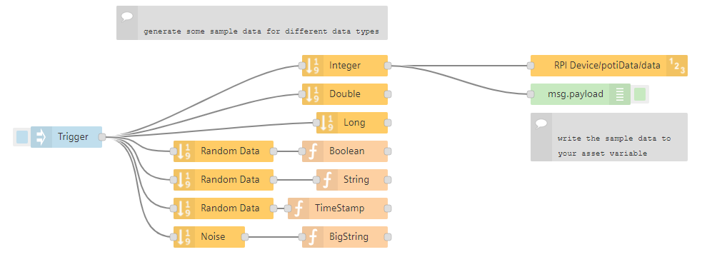

# Generate sample data

Did you sometimes asked yourself, how you get some sample data in your asset? Sample data e.g. for demonstration purposes, for debugging or for testing a new feature.

With this example you are able to do that.

# How to

- Import the flow in Visual Flow Creator
- Selet an asset / aspect / variable where you want to write time series data
- Doubleclick on the datatype node like `Integer` and rename the `Parameter out` value with the name of your data variable
- Save the flow
- Trigger the flow