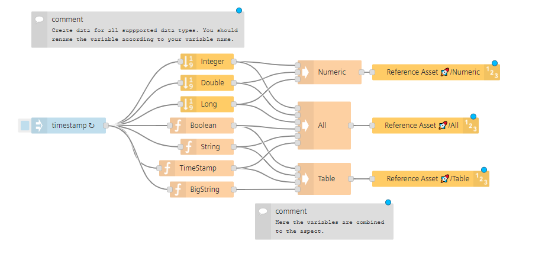

# FLOW: Integrate an external API

TODO

<!-- Insert a description for the example flow. Describe the use case or its specialty. -->

# Example image
<!-- Insert an example image -->
<!--  -->

# How to

<!-- Describe the necessary steps to get this flow running -->

# How does this flow works

<!-- Describe the flow and how it works -->
