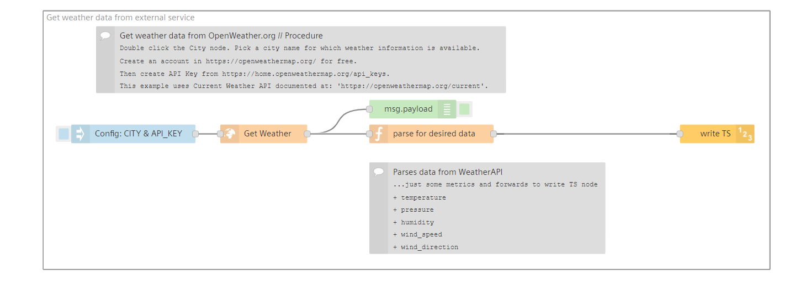
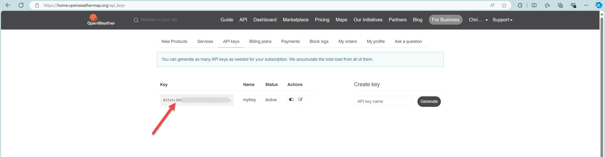

# Integrate an external API

Your business case may require to use external services over HTTP. Visual Flow Creator provides a means to consume such services.   

## Example based on external weather data
The example here demonstrates consuming a service from [OpenWeathermap](https://openweathermap.org) to bring weather information of a city.

## Setup & Configuration
1. Import the flow into Visual Flow Creator.
2. Obtain the API Key from [OpenWeather](https://home.openweathermap.org/api_keys). This will require a free account to be created, if not already done.
3. Double click the node named **Config: CITY & API_KEY**.
4. Replace the value field of `API_KEY` with the newly obtained API KEY from the above URL.
5. Change the value of the `CITY` field to a city name. The API supports limited set of cities. Please look in to their documentation. 
6. Save the flow after completing the needed changes.
7. Adopt the processing of the received information based on your needs. The example focuses on the weather details specified in the flow comment.
8. Click the inject node to trigger the sequence.
9. Output in the debug window shows the weather data for the chosen city.

## How does this flow work

 - The inject node passes the `CITY` and `API_KEY` information to HTTP Request node through `msg` object.
 - (**Get Weather**) node is the HTTP Request node and it contains the URL with query parameters.
 - This node performs the substitution of variables with the values it recieves from the inject node.
 - Then HTTP request node fetches the data synchronously from Openweather service endpoint.
 - It converts the recieved response to JSON format and sets it as value for the payload field of the msg object.
 - Debug node in the end displays the contents of payload field to the debug window. 

## Attachements
Here the `API_KEY` can get obtained from the external weather service. 

## See also
- [OpenWeathermap Website](https://openweathermap.org)
