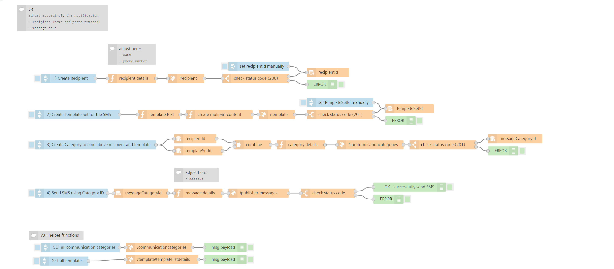

# HEADING for vfc-application example
<!-- (mandatory) Insert a description for the example flow. Describe the use case or its specialty. -->
This flow allows to send SMS notifications to a mobile phone. The template helps to specify the 
- recipient (name and phone number)
- create template for the SMS
- Create notification category to bind  recipient and template
- send SMS using category
... in dedicated flows. 

<!-- Insert an example image -->

## Setup & Configuration
<!-- (mandatory) Describe the necessary steps to get this flow running -->

1. Import the flow in Visual Flow Creator
2. Specify the recipient of your notificaton in the flow *1) Create Recipient* using the function node and trigger it's excecution
3. Set you message content in the function node in flow *4) Send SMS using Category ID*
4. Save the flow 

:cloud: :heavy_check_mark: You're ready to receive your SMS notifications after all four flows are triggered in sequence 1-4. Enjoy!

## How does this flow works
<!-- (optional) Describe the flow and how it works -->
To send a SMS via Notification Service, a recipient, SMS template and notification category need to be setup before the actuall message can be send. See also the Notification Service API descriptions to understand the overall workflow. 
During exection of flow 1), the recipient is added and it's ID is stored to a context variable as part of the VFC flow. Next a message template and template-set is created. It's internal IDs are also stored in context variables for usage in flow 3). Here, the notification category is set by linking the template to recipient(s). It feedbacks a category-ID which is then finally used in flow 4) to trigger the sending of the notification. Also the message content is specified in the last flow. 

   
## Result
<!-- (optional) Description on what the results are from this flow -->
Afer specifiying recipient (name, phone number) as well as message text, 
1. Execute flow *1) Create Recipient*
2. Execute flow *2) Create Template Set for the SMS*
3. Excecute flow *3) Create Category to bind above recipient and template*
4. Execute flow *4) Send SMS using Category ID*

And you should receive a SMS on the mobile number specified. :iphone: :bell:

## See also
<!-- (optional) Description on what the results are from this flow -->
- [Notification Service – API Overview](https://developer.mindsphere.io/apis/advanced-notification/api-notification-api.html)

