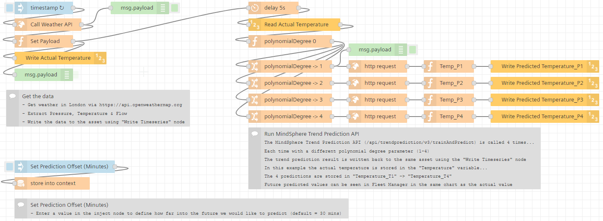
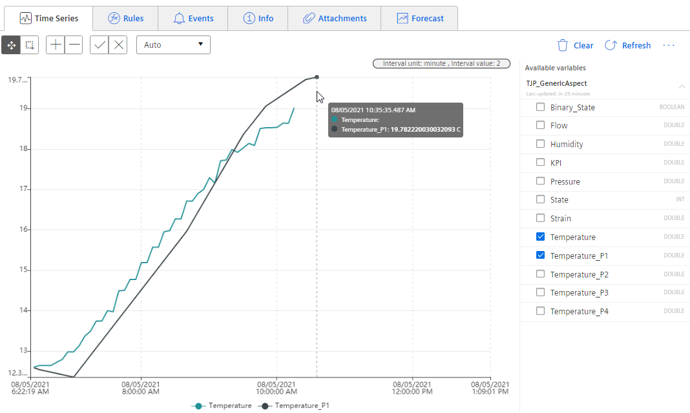

# FLOW: Running MindSphere's Trend Prediction API

This flow show ho to create a trend prediction from historic time series data. Future predictions can be used to trigger rules and create events (info/warning/error) in Fleet Manager/Operations Insights etc. This is  a very useful application within a Predictive Maintenance use case.

## Prerequisites
- Access to Visual Flow Creator
- An asset to read/write time series data from/to
- OpenWeathermap free account

## Setup & Configuration

1. Import the flow in Visual Flow Creator
2. Select the same asset for the following nodes:
	-"Write Actual Temperature"
	-"Read Actual Temperature"
	-"Write Predicted Temperature_P1 -> P4"
3. Create an OpenWeathermap API Key https://home.openweathermap.org/api_keys, and copy it into the "User Secrets" table in "Call Weather API", against the APPID secret.
3. Save the flow

:cloud: :heavy_check_mark: You're ready ... - enjoy!

## How does this flow works
The weather data (actual temperature) and predictions (predicted temperature) are written to an asset. In this example the actual temperature is stored in the "Temperature" variable...
The 4 predictions are stored in "Temperature_T1" -> "Temperature_T4"

## Result
Future predicted and actual values can be seen in MindSphere in various apps (Fleet Manager/Operations Insights etc.). In the screenshot below you can see actual temperature (Temperature) and predicted temperature (Temperature_P1)

## See also
- [:shopping_cart: MindSphere Store: Visual Flow Creator](https://www.dex.siemens.com/mindsphere/applications/visual-flow-creator?viewState=DetailView&cartID=&portalUser=&store=&cclcl=en_US)

