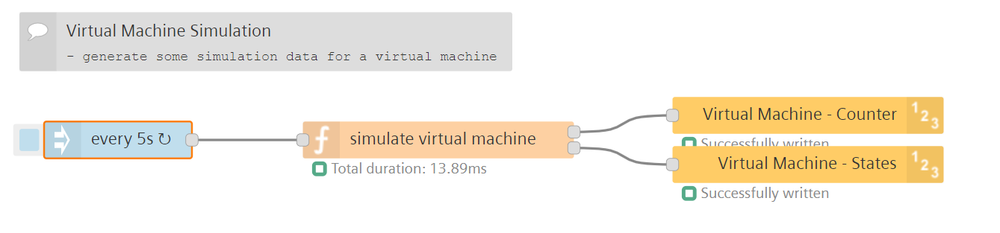
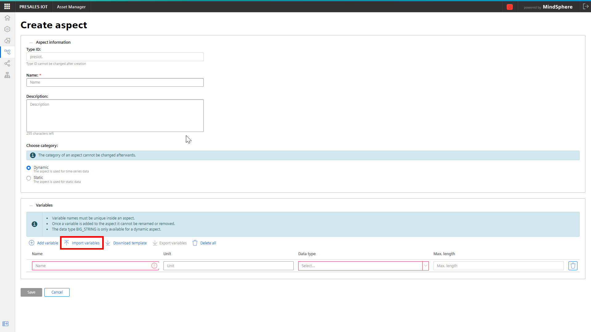
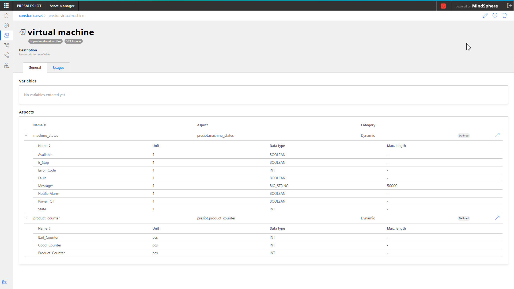
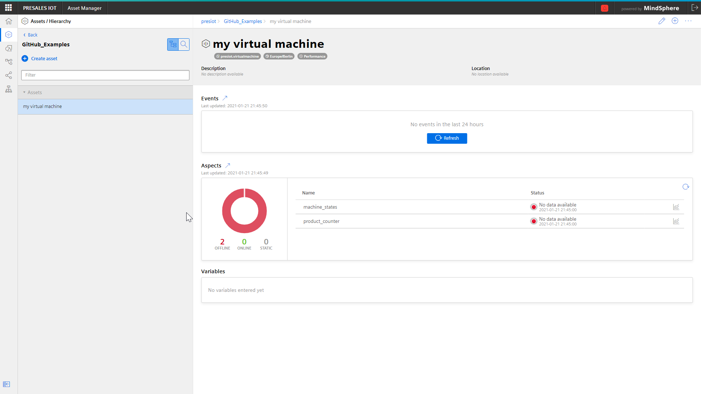
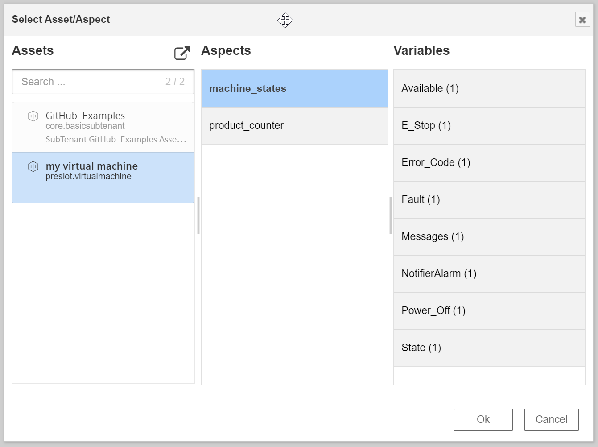
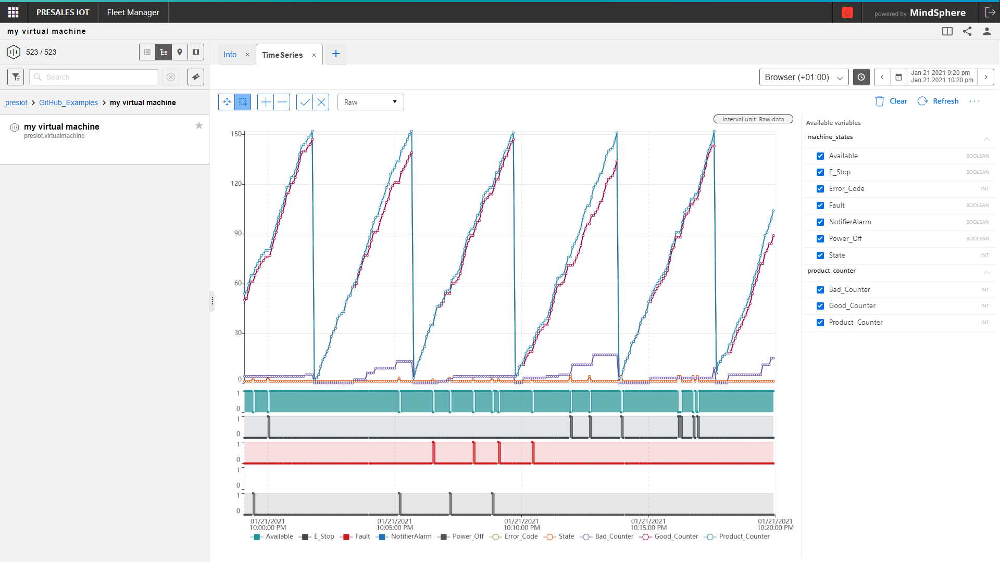

# Example Name
Using this flow, you can generate virtual machine data consisting of both a simulation for 
- machine states
- product counter

It can be used if no physical assets are available or to learn about the features on Insights Hub to explore VFC and other apps using the data stored in the Asset Management. The data generated can also be used further to calculate the machine OEE, Availability or Quality of the virtual products produced. 

## Prerequisites
- access to Asset-Managment 

## Setup & Configuration
### Setup machine asset
1. Open Asset Manager 
2. Create a new *Aspect* named `machine_states` using the .csv files found in the src folder. To import the data model for the machine, choose "Import variables" and select the csv files accordingly. 
    
3. Create a second new *Aspect* named `product_counter` using the same logic
4. Create a new *Asset-Type* named `virtual machine` and assign the two just created *Aspects* to it. Your data model for the machine should then look as follow 

5. Create a asset instance of the just defined *Asset-Type* using a asset name of choice  
e.g. `my virtual machine`

### Setup in Visual Flow Creator
1. Import the flow in Visual Flow Creator
2. Open the settings for the **upper** write-timeseries node select the previously generated asset instance `my virtual machine` and aspect `machine_states`. Do not select any variables. 
    
4. Repeat this for the **lower** write-timeseries node and select `my virtual machine` -> `product_counter`. Do not select any variables.  
5. Adjust the execution intervall for the simulation as desired in the link-in node.
6. Save the flow 

:cloud: :heavy_check_mark: You're done, your machine simulation is now running - enjoy!

## Result
After saving the flow, the output of the simulation is written to the asset and you can monitor the results e.g. in Fleet Manager. Based on this you can also now start calculating the machine KPIs (OEE, Availability, Quality, ...) using the VFC or other apps. 

## See also
- [Asset Manager Documentation](https://documentation.mindsphere.io/resources/html/asset-manager/en-US/index.html)

